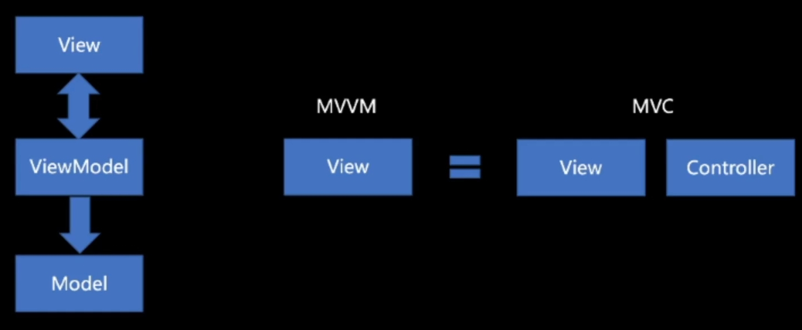
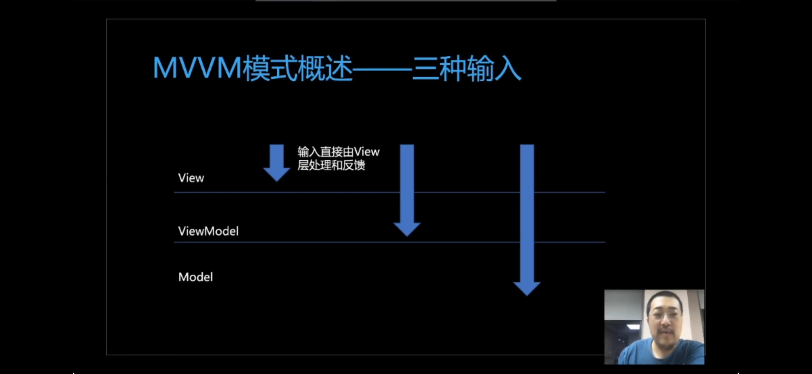
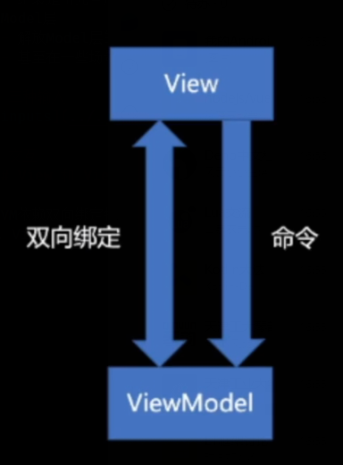
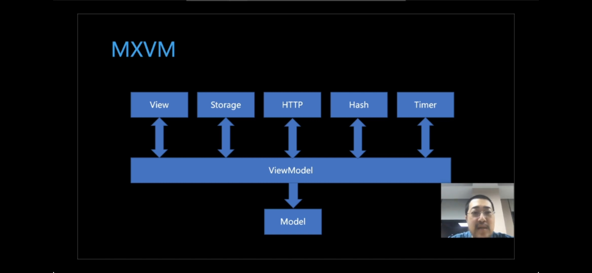

# MVVM

## 架构

## 目标
- View层
  - 有一定处理输入并作出反馈的能力
  - 每一个组件应该来自UI库, UI库的作者并不知道业务
  - 组装是由完全声明式的代码完成的, 它可能是由设计师通过工具直接生成的
- Model层
  - 解放Model层的编写，Model层是完全自由的，在其他层编写时不能假设其结构，
  - 甚至在一些场景下，Modal可能是已经存在但和UI无关的代码

## 三种输入

## 交互
### View 和 ViewModal

MVVM依赖双向绑定特性，View并非单纯的输出，一些View具备输入能力。在双向绑定中，View的输出直接Modal层的某个值产生编辑效果，如输入框、开关都是典型的View

## 扩展

