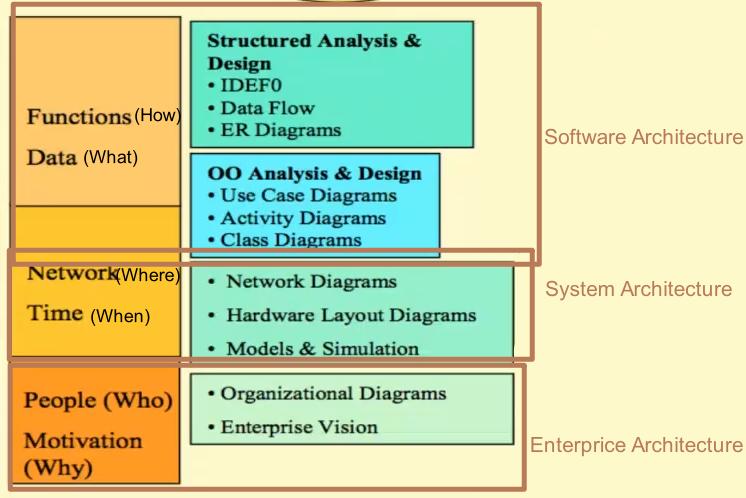
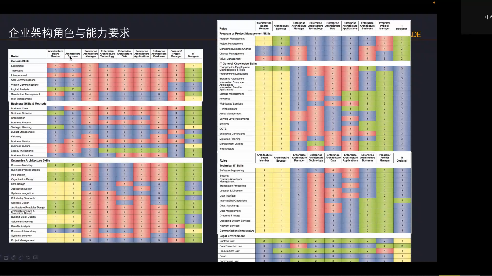
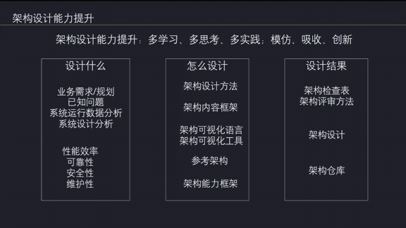

- [软件架构](#软件架构)
- [系统架构](#系统架构)

# 架构

**没有正确的答案，只有不同的错误**

- **架构是关于改动的**。总会有人改动代码。评价架构设计的好坏就是评价它应对改动有多么轻松。
  每当你添加了抽象或者扩展支持，你就是在**赌**以后**这里**(抽象的位置)需要**灵活性**。模块化如果最终无益，那就有害。
  除非确信需要灵活性，否则不要在这上面浪费时间。
- **架构是关于产品的**。如果是一个 web 项目，那么它的抽象就在于 UI 表现的公共性，以及应对多种用户角色和网络场景的层面；而如果是一个游戏项目，那么它的抽象就在于性能和游戏进程。

架构的层次

架构的要求

架构的学习提升

## 软件架构

- **抽象和性能需要妥协**。架构的目的是使程序更加灵活，编码时对程序有更少的假设，但性能依赖于假设。
  让有趣的软件变得高效比让高效的软件变有趣简单得多。**保持代码灵活直到确定设计**，再去除抽象层来提高性能。
  但是尽可能推迟那些底层的，基于假设的优化，那会锁死代码
- **如果打算抛弃一段代码，就不要尝试将其写完美**。如果有可能要维护这段代码，就得防御性地好好编写它。可抛弃的代码即使看上去能工作，也不能被维护，必须重写

## [系统架构](./System.md)
