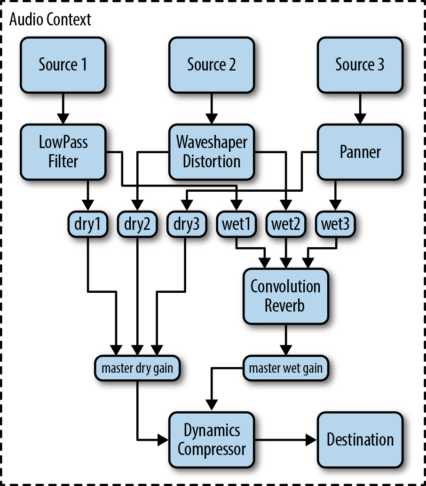

- [Basic](#basic)
  - [采集](#采集)
  - [编码过程](#编码过程)
    - [遮蔽处理](#遮蔽处理)
    - [量化编码](#量化编码)
    - [封包/格式化](#封包格式化)
  - [编解码器](#编解码器)
    - [AAC](#aac)
- [WebAudio](#webaudio)
  - [Basic](#basic-1)
  - [Advanced](#advanced)
    - [Intro: Modular](#intro-modular)
    - [Source Node](#source-node)
    - [Modification Node](#modification-node)

## Basic

### 采集

```txt
         次声波         可听声波          超声波
听觉范围  -------┴--------------------┴----------→ F(Hz, 振荡次数/每秒)
              20Hz                 2kHz
发声范围             └------------┘
                   85Hz       1100Hz
```

音频模拟信号三要素：音调(频率的快慢)、音量(频率的幅度)、音色(谐波)

音乐的主要频谱集中在低频段，高频段幅度很小，但很重要，决定了音质

要将一段音频模拟信号转换为数字信号，包含如下三个步骤：

1. Sampling(采样)
   - 定义声道数，按照声道数接受多声道的信号
   - 定义采样率(采样速率, Hz)，按照采样率采样
2. Quantization(量化)
   - 定义位深(采样可舍入大小, bit), 按照位深进行采样数据的舍入
3. Coding(编码)
   - 定义大小端，音频通常为小端存储
   - 可以求得对应`编码码率/比特率(kbps) = 位深 * 采样率 * 声道数`
   - 以及对应`大小(Mb) = 时长(s) * 码率 / 1024 / 8`

采集完后的即为 PCM(Pulse Code Modulation, 用数字表示的采样模拟信号) 流

或添加 WAV Header：


### 编码过程

因为 PCM 文件大小太大，因此需要编码(压缩)

#### 遮蔽处理

有损压缩。

因为录制的音频 PCM 可能包含人类听觉范围外的声音，以及一些干扰声音(遮蔽)，所以需要去掉

遮蔽包含

- 频域遮蔽
  - 一个强纯音会掩蔽在其附近同时发声的弱纯音，这种特性称为频域掩蔽
  - 
- 时域遮蔽
  - 掩蔽效应发生在掩蔽声与被掩蔽声不同时出现时，又称异时掩蔽
  - 假设一个很响的声音后面紧跟着一个很弱的声音，而时间差在 200ms 之内，弱音就很难听到，相反在弱音后紧跟着一个很强的音，而时间在 50ms 之内，弱音也是很难听到
  - 时域通常会经过一系列变换(傅里叶、小波)转为频域处理
  - 

#### 量化编码

可以是无损也可以是有损。

此时会改变`可播放码率(kbps) = 文件大小(kb) / 长度(s)`。压缩后的码率将会是动态的

- VBR(Variable Bitrate, 动态码率)
  - 根据音频数据即时确定使用什么码率，这是以质量为前提兼顾文件大小的方式
- CBR(Constants Bit Rate, 固定码率)
  - 优点是压缩快，能被大多数软件和设备支持，缺点是占用空间相对大，效果不十分理想
  - 现已逐步被 VBR 的方式取代

#### 封包/格式化

添加一些额外内容，以实现跳转播放、信息处理等

### 编解码器


#### AAC

##### 版本

目标是取代 MP3 格式

- 采样率选择：8kHz ~ 96kHz，MP3 为 16kHz ~ 48kHz
- 声道数上限：48 个，MP3 在 MPEG-1 模式下为最多双声道，MPEG-2 模式下 5.1 声道

最早是基于 MPEG-2 标准，称为：MPEG-2 AAC。后来 MPEG-4 标准在原来基础上增加了一些新技术，称为：MPEG-4 AAC

```txt
┌---AAC------------------┐
| ┌---------------┐      |
| |               |      |
| | AAC LC + SBR  | + PS |
| |               |      |
| └--AAC HEv1-----┘      |
|      AAC HEv2          |
└------------------------┘
```

- AAC LC(Low Complexity)
  - LC 码率在 96kbps ~ 192kbps 之间
- AAC HEv1(High Efficiency)
  - AAC LC + SBR
    - SBR(Spectral Band Replication, 频段复制)
    - 核心思想是按照频谱分别编码保存。低频编码为主，高频单独放大编码保存音质
  - 码率 48kbps ~ 64kbps
- AAC HEv2
  - AAC HEV1 + PS
    - PS(Parametric Stereo, 参数立体声)
    - 是一种有损的音频压缩算法，可以进一步提高压缩率
    - 存储一个声道的全部信息，然后花很少的字节用参数描述另一个声道和它不同的地方
  - 码率可以低于 32kbps

在低码率的情况下，AAC HEv1，AAC HEv2 编码后的音质要明显好于 AAC LC。而在码率较大后(128kbps)，其主观质量逐渐相同

##### 协议格式

- extradata
  - 在第一个头里，解码时先传输 extradata 信息，然后开始传输 raw data
  - 包含比特率、位深等信息
- ADIF
  - Audio Data Interchange Format
  - 只有一个头，其余后面都跟着 raw data
  - 仅能从开始处顺序一帧一帧解码，无法从中间位置解码
- ADTS
  - Audio Data Transport Stream
  - 每帧都带 7/9 字节头(9 字节包含 CRC 校验，但一般不做)
  - 方便跳播，从任何位置都可以直接进行解码
  - [含义解析](https://www.p23.nl/projects/aac-header/)
- LATM
  - Low-overhead MPEG-4 Audio TransportMultiplex
  - 每帧都带头，但传输时可以配置跳过头发送

## WebAudio

### Basic

https://developer.mozilla.org/en-US/docs/Web/API/HTMLMediaElement

仅涉及如何加载音频、开始暂停、音量、速度、手动控制播放点

```jsx
const Audio = ({
  sources = [
    { src: "xx.mp3", type: "audio/mpeg" },
    { src: "yy.ogg", type: "audio/ogg" },
  ],
  fallbackMsg,
}) => {
  const audioRef = useRef(null);
  const duration = useState(0);
  const currentTime = useState(0);
  const progress = useState(0);

  useEffect(() => {
    if (!audioRef.current) {
      sources.forEach((s) => {
        const audioTester = document.createElement("audio");
        if (audioTester.canPlayType(s.type) == "probably") {
          // or "maybe" (until playback is actually attempted)
          audioRef.current = new Audio(s.src); // return a HTMLMediaElement
        }
      });
    }

    audioRef.current.addEventListener("loadedmetadata", (e) => {
      duration[1](e.target.duration);
    });
    audioRef.current.addEventListener("timeupdate", (e) => {
      let value = e.target.currentTime / audioRef.current.duration;
      progress[1](value * 100);
      currentTime[1](e.target.currentTime);
    });
  });

  return (
    <>
      <audio preload="metadata" ref={audioRef}>
        {/* 浏览器会使用第一个它支持的播放源 */}
        {sources.map((s) => (
          <source src={s.src} type={s.type} />
        ))}
        <p>{fallbackMsg || "Your browser doesn't support HTML5 audio"}</p>
      </audio>

      <div className="audio-container">
        <div
          onClick={(e) => {
            audioRef.current.play();
            audioRef.current.pause();
          }}
        >
          {audioRef.current.paused ? "暂停" : "播放"}
        </div>
        <div
          onClick={() => {
            audioRef.current.loop = true;
          }}
        >
          单曲循环
        </div>
        <div
          onClick={() => {
            audioRef.current.playbackRate = Math.random();
          }}
        >
          播放速度
        </div>
        <div
          onClick={() => {
            audioRef.current.volume = Math.random();
          }}
        >
          音量
        </div>
        <div className="audio-progress-box">
          {/* 拖动播放位置查看：https://juejin.cn/post/6936141251247308813 */}
          <span className="progressDot"></span>
          <div className="audio-progress-bar"></div>
        </div>
        <div className="audio-time">
          <span>{currentTime[0]}</span> / <span>{duration[0]}</span>
        </div>
      </div>
    </>
  );
};
```

### Advanced

#### Intro: Modular

WebAudio API 以模块形式组合(如调整音高以音高模块实现)，类似于现实的调音


模块大致上分为以下几种：

- Source nodes<br/>
  Sound sources such as audio buffers, live audio inputs, `<audio>` tags, oscillators, and JS processors
- Modification nodes<br/>
  Filters, convolvers, panners, JS processors, etc.
- Analysis nodes<br/>
  Analyzers and JS processors
- Destination nodes<br/>
  Audio outputs and offline processing buffers

各种模块以`AudioContext`连接和交互

```js
const context = new AudioContext();

// 模块都有一个connect方法
function connectNode(curNode, preNode, nextNode) {
  const prior = preNode || context.createBufferSource();
  const posterior = nextNode || context.destination;

  prior.connect(curNode);
  curNode.connect(posterior);
}
```

#### Source Node

```js
// 和Graphics的设计类似，需要一个context去操作Audio
const context = new AudioContext();
const sound = new ArrayBuffer(); // 音源以ArrayBuffer形式存在

// 加载音源数据
context.decodeAudioData(sound, (buf) => {});

function playSound(soundBuffer, time = 0) {
  var source = context.createBufferSource(); // creates a sound source
  source.buffer = soundBuffer; // tell the source which sound to play
  source.connect(context.destination); // connect the source to the context's destination (the speakers)
  source.noteOn(time); // play the source at the precise time
}
```

#### Modification Node

##### 音量(音高增益模块)

```js
var gainNode = new GainNode(context); // 通过 GainNode 实现
connect(gainNode); // 连接其它节点
gainNode.gain.setValueAtTime(volume, context.currentTime); // 调节增益值(音量)
```
