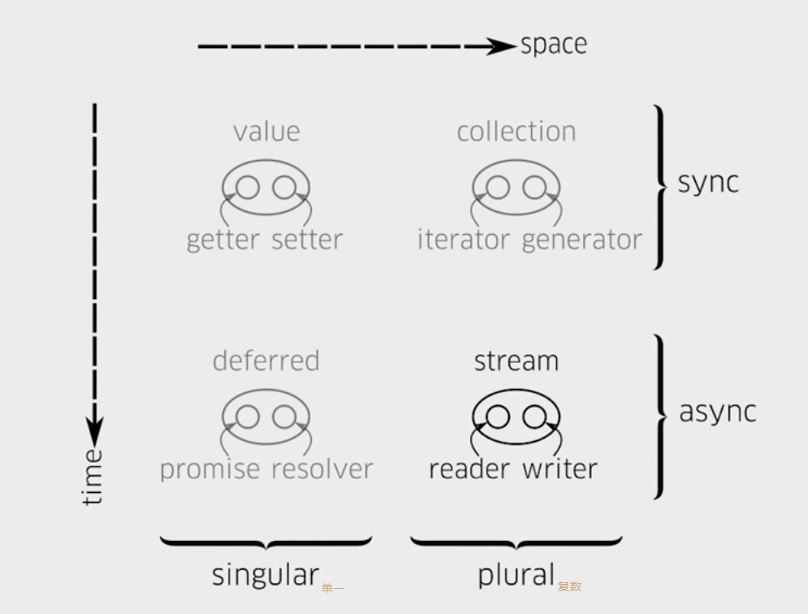

- [Promise, Generator](./Promise_Async_Generator.md)
- [流](./stream.md)
- [Rxjs](./Rxjs.md)
- [事件溯源模式](./event-sourcing.md)

// 异步工作流库 (简便处理限制并行，复杂依赖的函数链)
// https://github.com/caolan/async
// https://github.com/npm/slide-flow-control (带 use case 的实现 demo)

防止事件循环

- 当新值等于旧值时， trigger 方法不会导致触发 change 事件
- 模型正处于自身的 change 事件期间时，不会再触发 change 事件
- 如果在 trigger 方法中添加了{silent:true}选项，则不会触发 change 事件

[Concurrency in JS](https://advancedweb.hu/how-to-use-async-functions-with-array-map-in-javascript/)
