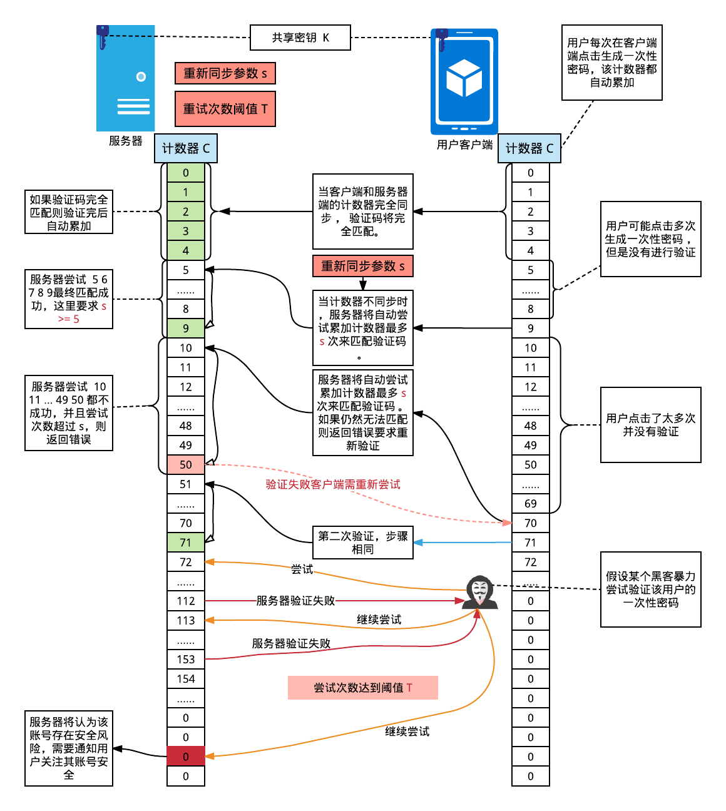

- [OTP](#otp)
- [HOTP](#hotp)
- [TOTP](#totp)
- [2FA](#2fa)

## OTP

One-Time Password

即提供一次性的随机数，没有明确的算法。只需要和账户绑定且一次性即可

## HOTP

[RFC4226, HMAC-based One-Time Password](https://datatracker.ietf.org/doc/html/rfc4226)

伪代码：

```js
function HOTP() {
  const secret = "6shyg3uens2sh5slhey3dmh47skvgq5y";

  let counter = 1;
  const fixedCounter = toFixedInt64(counter); //(8-bit，高位字节若不足应填充 0x00)

  const hash = HmacSHA1(fixedCounter, secret); // b0 d4 8d 7f 4d 5d 39 49 ca 71 97 08 28 14 ec 6e e6 b5 14 a5
  // SHA1 生成的为 20 字节，转换为十六进制字符串为长度 40，不便于用户输入
  // 因此，需要将摘要结果转换为便于用户输入的数据，也就是六位数数字

  const transfer = (hash) => {
    /**
     * 转换算法为，取摘要结果最后一个字节的低 4 位，作为偏移值，然后以该偏移值为下标，从摘要中取从下标为该偏移值开始的 4 个字节，按大端模式组合成一个纯数字并忽略符号位，再取这个数字的后六位。长度不足 6 的高位补 0。
     */
    /**
     * 例子最后一个字节：0xa5, 1010 0101，低四位: 0101 0x5
     * 该偏移值开始的 4 个字节:
     * b0 d4 8d 7f 4d 5d 39 49 ca 71 97 08 28 14 ec 6e e6 b5 14 a5
     * ---------------***********---------------------------------
     * 按大端16进制转10进制纯数字，并忽略符号位: 1564035530
     * 取后 6 位: 1564035530 mod 10e6 = 035530
     */
  };

  const result = transfer(hash);
  counter++;

  return result;
}
```

HOTP 存在一个严重缺点：在离线状态下，应当如何同步计数器？由于离线状态各个终端无法通信，因此刷新计数器只能靠推测刷新。因此极易出现不同步，导致失败。

## TOTP

[RFC6238, Time-Based One-Time Password](https://datatracker.ietf.org/doc/html/rfc6238)

只是把 HOTP 中的计数器换成了时间戳，除此之外没有任何区别:

```js
const counter = floor(currentTimestamp / tolerance);
// tolerance 指多少时间内失效
```



## 2FA

[Extensions to Salted Challenge Response (SCRAM) for 2 factor authentication](https://datatracker.ietf.org/doc/html/draft-melnikov-scram-2fa-03)

2FA 加强并扩展了 TOTP 的校验规则及相关加密过程。草案基于谷歌验证器所拟。

```js
const crypto = require("crypto");
const b32Decode = require("base32-decode");

// 用户密钥。长度应当为 20 字节，且结果应当使用 Base32 进行编码
const secret = b32Decode(
  "6shyg3uens2sh5slhey3dmh47skvgq5y".toUpperCase(),
  "RFC4648",
);
// 时间戳计数器
const T = Math.floor(Date.now() / 1000 / 30);
/**
 * 数字转 Int64 字节流
 * @param {number} num
 * @returns
 */
function intToBytes(num) {
  var bytes = [];

  for (var i = 7; i >= 0; --i) {
    bytes[i] = num & 255;
    num = num >> 8;
  }

  return bytes;
}

// 计算 HMAC-SHA1，密钥为 secret，消息为 T
const hmac = crypto.createHmac("sha1", secret);

const T1 = Buffer.from(intToBytes(T));

const HS = hmac.update(T1).digest();

// 取出最后个字节的低 4 位
const offset = HS[19] & 0xf;

// 将从 offset 开始的四个字节按大端组装为整数
let bytes =
  ((HS[offset] & 0x7f) /** 这里是为了忽略符号位 */ << 24) |
  (HS[offset + 1] << 16) |
  (HS[offset + 2] << 8) |
  HS[offset + 3];

// 整数转字符串，然后取出后六位
let code = bytes.toString().slice(-6);

// 不足 6 位数则补 0
for (let i = 0; i > 6 - code.length; i++) {
  code = "0" + code;
}

// 打印用户验证码
console.log(code);

// Google 验证器消息
const label = "Anonymous";
const issuer = "GoogleFake";
const qrcode = `otpauth://totp/${label}?secret=${secret}&issuer=${issuer}`;
```
