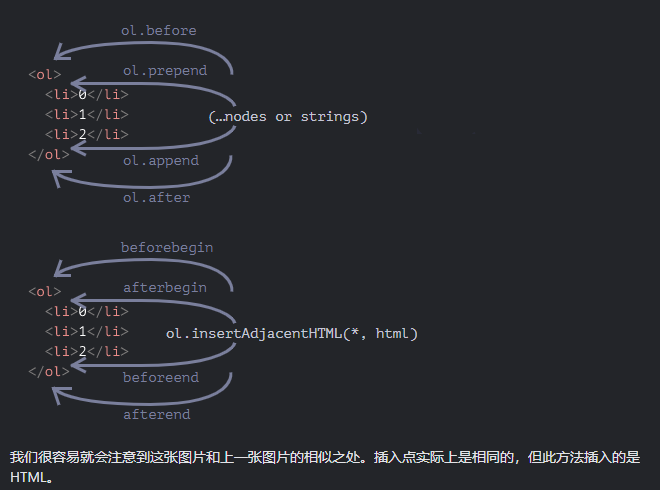
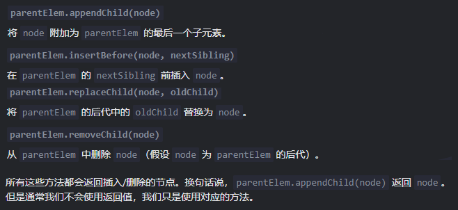
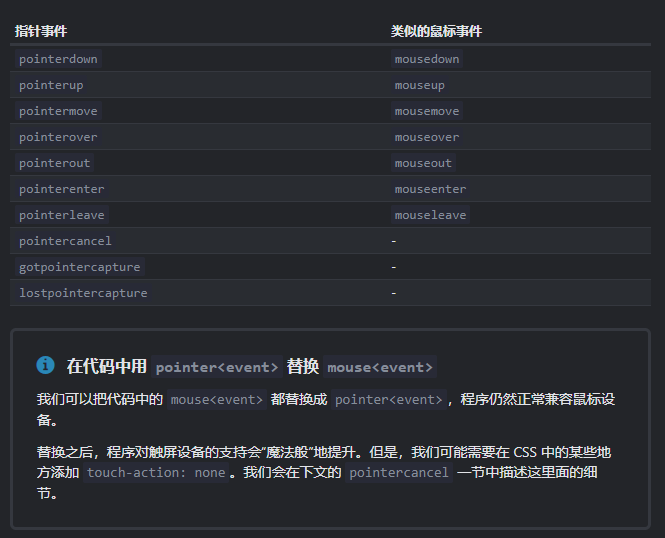

- [Favicon](#favicon)
- [事件周期](#事件周期)
  - [在线和离线事件](#在线和离线事件)
- [CSS 处理](#css-处理)
  - [媒体查询](#媒体查询)
- [检查/搜索元素](#检查搜索元素)
  - [父元素](#父元素)
  - [当前元素](#当前元素)
  - [子元素](#子元素)
  - [窗口坐标](#窗口坐标)
- [节点增删改和移动](#节点增删改和移动)
- [图片懒加载](#图片懒加载)
- [指针事件](#指针事件)
  - [鼠标拖放](#鼠标拖放)
  - [setPointerCapture](#setpointercapture)
- [文本/节点选择](#文本节点选择)
  - [Selection 对象](#selection-对象)
  - [input/textarea](#inputtextarea)
  - [Range 对象](#range-对象)
- [多窗口](#多窗口)
  - [弹窗](#弹窗)
  - [iframe 及 postMessage](#iframe-及-postmessage)

## Favicon

https://realfavicongenerator.net/

```html
<link rel="icon" href="/favicon.ico" sizes="any">
<!-- 32x32;48x48;128x128px, size=any表示icon是任意大小,主要用于糊弄chrome让它用svg; -->
<link rel="icon" href="/favicon.svg" type="image/svg+xml">
<!-- type=image表示图像格式,主要用于适配safari让他明白这是svg -->
<!-- 现代浏览器都应使用svg的favicon,ico用于老旧浏览器兼容 -->
<link rel="apple-touch-icon" href="/apple-touch-icon.png"/>
<!-- 180x180px, apple-touch-icon用于ios及其他操作系统pwa时 -->
<link rel="manifest" href="/site.webmanifest" />
<!-- webmanifest用于安卓 -->
```

## 事件周期

```js
<script>
  log('initial readyState:' + document.readyState);

  document.addEventListener('readystatechange', () => log('readyState:' + document.readyState));
  document.addEventListener('DOMContentLoaded', () => log('DOMContentLoaded'));

  window.onload = () => log('window onload');
</script>

<iframe src="iframe.html" onload="log('iframe onload')"></iframe>


<script>
  img.onload = () => log('img onload');
</script>
/**
 * 输出顺序：(方括号中的数字表示大致时间)
  [1] initial readyState:loading
  [2] readyState:interactive (DOM 树就绪，但像  和样式表之类的外部资源可能尚未加载完成)
  [2] DOMContentLoaded (在interactive后立即触发)
  [3] iframe onload
  [4] img onload (页面parse顺序)
  [4] readyState:complete (所有资源（iframe 和 img）都加载完成后)
  [4] window onload (始终在所有其他 load 处理程序之后运行)
*/
```

### 在线和离线事件

[Online/Offline](https://developer.mozilla.org/zh-CN/docs/Web/API/NavigatorOnLine/Online_and_offline_events)

## CSS 处理

```ts
style.cssText; //对整个 "style" 进行替换
```

### 媒体查询

```js
window.matchMedia("(min-width: 500px)").addListener(Callback);
```

## 检查/搜索元素

### 父元素

```ts
elem.closest(css); //方法会查找与 CSS 选择器匹配的最近的祖先。elem 自己也会被搜索。

// 复杂的检查
function parentNodesCheck(
  node: HTMLElement,
  checker: (parent: HTMLElement) => boolean,
) {
  let element = node;
  while (element) {
    if (checker(element)) {
      return;
    }

    element = element.parentElement;
    //document.documentElement.parentNode == document
    //document.documentElement.parentElement == null
  }

  return;
}
```

### 当前元素

```ts
elem.matches(css); //不会查找任何内容，它只会检查 elem 是否与给定的 CSS 选择器匹配
```

### 子元素

```ts
elemA.contains(elemB); //如果 elemB 是 elemA 的后代或者 elemA==elemB
```

### 窗口坐标

```ts
// 如果在xy可视区域外，返回null
document.elementFromPoint(x, y); //返回在窗口坐标 (x, y) 处嵌套最多（the most nested）的元素
document.elementsFromPoint(x, y); //所有元素
```

## 节点增删改和移动





> 移动时都会自动删除旧的节点

```ts
node.replaceWith(..."nodes or strings"); //替换 node。
node.remove(); // 移除 node
```

## 图片懒加载

img 的 src 设置时才会向服务器发起请求加载图片，<br/>
因此懒加载目的就在于让 img 在可视区域时才获得 src 属性

```jsx
//首先在DOM节点保存将要加载的属性：
   //data-*属性来存储数据
//之后在可视区域时 参考: (https://juejin.im/post/5be03f4fe51d45053a454e69)，通常使用 getBoundingClientRect/ Intersection Observers 等
    //将data-*换成src属性
// 现代浏览器设置loading属性即可

```

## 指针事件

Simple Guide

1. https://zh.javascript.info/mousemove-mouseover-mouseout-mouseenter-mouseleave
2. https://zh.javascript.info/pointer-events



### 鼠标拖放

[sample](https://codepen.io/AllenEyes/pen/OJmzxLg)

### setPointerCapture

- 可以在 `pointerdown` 事件的处理程序中调用 `thumb.setPointerCapture(event.pointerId)`
- **接下来发生的所有指针事件都会被重定向到 `thumb` 上**
- 当 `pointerup/pointercancel` 事件发生、`elem` 被移除、`elem.releasePointerCapture` 调用时，绑定会被自动移除

## 文本/节点选择

Referrer: https://zh.javascript.info/selection-range

没有直接监听选择字的事件, 但有读取选择区间的<br/>
所以可以加一步鼠标监听来配合达到

### Selection 对象
允许读取、添加、删除等选择内容/节点

```js
function getSelectedText() {
  if (window.getSelection) {
    return window.getSelection().toString();
  } else if (document.selection) {
    return document.selection.createRange().text;
  }
  return "";
}
// only document 当选择发生变化或开始时
// workaround: $("div").mouseup
document.onselectionchange = function() {
  let selection = document.getSelection();// or window.getSelectText();
  // Selection 对象允许读取、添加、删除等选择内容/节点

  let {anchorNode, anchorOffset, focusNode, focusOffset} = selection;

  // anchorNode 和 focusNode 通常是文本节点
  const from = `${anchorNode?.data}, offset ${anchorOffset}`;
  const to = `${focusNode?.data}, offset ${focusOffset}`;
  // 获取选择的节点的文本内容
  console.log(from, to, selection.toString());

  selection.removeAllRanges(); // 清除现有选择。否则浏览器将忽略新范围
};
```

### input/textarea
有单独的选择API

```js
input.selectionStart/selectionEnd/selectionDirection
input.select()/setSelectionRange()/setRangeText()
input.onselect
```

### Range 对象
会包含选择的node，没有直接取文本的。Range允许对 node 选择、复制、删除、插入等

```js
let range = Range();
range.setStart(p.firstChild, 2);
range.setEnd(p.firstChild, 4);
```

## 多窗口

### [弹窗](https://zh.javascript.info/popup-windows)

### [iframe 及 postMessage](https://zh.javascript.info/cross-window-communication)
