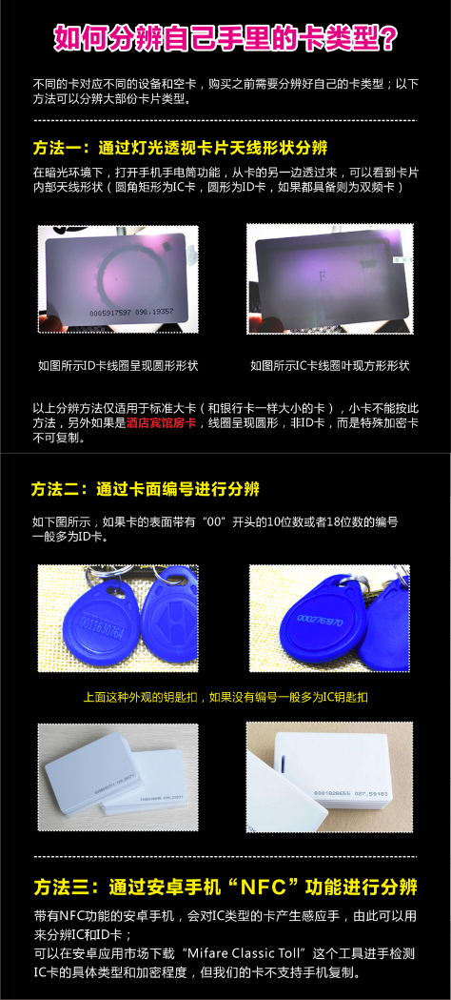

## 介绍和各种卡种区别

射频识别(Radio Frequency IDentification，缩写：RFID)是一种**无线**通信技术，使用了这个技术的“卡”都能称为**RFID 卡**

近场通信(英语：Near-field communication，NFC)，是一套通信协议

|          |                                  RFID                                   |    NFC    |
| :------: | :---------------------------------------------------------------------: | :-------: |
| 传输距离 |                              几米到几十米                               | 小于 10cm |
| 工作频率 |       低频(125KHZ~135KHZ)，高频(13.56MHz)及超高频(860MHZ~960MHZ)        | 13.56MHZ  |
| 通信模式 |                                  主从                                   |    P2P    |
|   协议   | 底层通讯协议兼容高频 RFID 的底层通信标准，即兼容 ISO14443/ISO15693 标准 |     /     |

|          |        IC 卡         |             ID 卡              |
| :------: | :------------------: | :----------------------------: |
| 工作频率 |       13.56MHz       |             125KHZ             |
|   读写   | 可提权后写，授权后读 |   不可写入数据，卡号是公开的   |
|   内容   |       随意数据       | 卡内除了卡号外，无任何保密功能 |

## IC(Integrated Circuit) Card

IC 卡(Integrated Circuit Card，集成电路卡)。是将一个微电子芯片嵌入符合 ISO/IEC 7816(接触式) 或 ISO/IEC 14443(非接触式，又分 typeA 和 typeB 标准) 标准的卡基中，做成卡片形式。
接触型 IC 卡不属于 RFID 卡，因为 RFID 的一大特征就是可以无接触，常见的接触型 IC 卡有：银行卡，SIM 卡等等。最明显的特征就是其裸露的芯片。
但非接触式 IC 卡属于 RFID 卡

typeA 采用开关键控(On-Off keying)的 Manchester 编码，typeB 采用 NRZ-L 的 BPSK 编码
typeA 基于位冲突检测协议，而 typeB 通信系列命令序列完成防冲突

### MIFARE

#### Classic 1K 卡

目前最常见 IC 卡。又称为 M1 卡。
卡的 UID 出厂固定，可以修改储存的数据。
其中 Mifare S50 容量为 1KB，Mifare S70 为 4KB

M1 卡由 16 个扇区组成，每个扇区有 4 个数据快，每个数据块有 16 个字节(16x4x16=1024)。其中 0 扇区的第 0 块存着卡片以及厂商的信息。
每个扇区有两个密钥，keyA 和 keyB，3 区块中间的四位是存储控制位，决定的这个扇区的权限。

根据两个密钥的加密有：

- 非加密卡：所有的 16 个扇区都是默认密钥，或者弱口令。此类卡，[pm3](https://www.cnblogs.com/jayway0day/p/9212403.html) 一般都能直接破解
- 半加密卡：有一部分扇区不使用默认密钥，这类卡 pm3 大部分也能直接破解
- 全加密卡： 16 个扇区都被加密了，此类卡往往破解难度很大，pm3 也有可能解不出来。对付全加密卡，就需要[变色龙](https://github.com/emsec/ChameleonMini)(单片机)的嗅探。

#### UltraLight 卡

也被称为 M0 卡。其容量只有 512bit(64B)。被划分为了 16 个 page，每个 page 包含 4 个字节
其 UID 有 7 个字节长，而 M1 卡只有四个。而且 M0 卡没有加密，所以 M0 卡只能用在一些身份识别的地方，比如地铁票，园区票之类

#### MIFARE Plus 卡

有两种，分别是 S 和 X。Plus 是 M1 卡的升级，向下兼容 M1 卡，所以也被称为 M1P 卡，安全性对比 M1 卡有很大的提升

可以通过 SAK 值判断型号：

### NTAG

NTAG 是 NXP 公司的一种 NFC 卡，从名字就可以看出，这种卡是符合 NFC 规约的 Tag，可以被所有的 NFC 设备读取

其中 NTAG203(144 bytes) 没有密码保护功能，用法 Mifare Ultralight 基本一样。
而 21X 系列卡，有密码保护功能，市面上常用 NTAG 213(144 bytes)

### UID

是国人发明的，全称 Mifare UID Chinese magic card —— 中国魔术卡，国外称为 GEN1。
是针对 S50 的变种卡，用起来和 M1 S50 一模一样，但是 0 扇区可以随便修改，也就是说，卡号可以随便修改，厂商信息也可以随便更改，可以用来复制 M1 卡。
但读卡系统可以通过检测卡片对特殊指令的回应，检测出 UID 卡，因此达到屏蔽复制卡的功能

#### CUID

国外称为 GEN2，是 UID 卡的一种升级版。
可以重复修改 0 块，但是它和 UID 卡的区别是，UID 卡是通过指令修改 0 块，CUID 使用的是常规密码验证的方法写 0 块(写错了之后重写需要清卡)，其他扇区和标准 M1 卡相同。
缺点是，还是有可能会被检测出来，而且如果不小心写错了 UID 号的校验位导致无法读卡，只能报废

#### FUID

国外也称 GEN2，是针对 UID 卡做的优化。
FUID 可以修改 0 块，但只可以修改一次，写错也没办法更改，也不能重复利用。修改后和 M1 卡完全一样，很难被屏蔽检测。

#### xUID

新出的版本。有 KUID、SUID、NUIC

### CPU

现在没有统一的标准。内置 CPU、ROM、RAM、EEPROM，基本上算是一个单片机。(通过电磁感应供电)
极难破解的同时，CPU 卡还支持数据上云，即卡本身不存数据，只起到 ID 的作用

CPU 卡现在无法破解，但是可以通过复制其 UID 到手环或者白卡里面，使用部分功能。UID 从 ATS 中获取，取 ATS 的后四位

和 M1 卡区分：如果卡支持在线充值，且有挂失功能，大概率是 CPU 卡(如 sim 卡)

#### CPU 模拟卡

是 CPU 卡+M1 卡合制而成，主要是简化成本。通常是 CPU 容量 7k + M1 容量 1K

通常模拟卡的 SAK 为 28，ATQA: 0004，TYPE: JCOP31 or JCOP41 v2.3.1

### 双频卡

是两种频率的线圈塞进一张卡里的产物，有低频+高频和高频+超高频(902~928MHz)。
就是 ID 卡(比较小)塞进 IC 卡里。

## ID(Identification Card) Card

ID 卡有很多种不用的芯片，由许多不同的公司生产的，常见的有：Mifare UtraLight IC U1、Mifare DESFire 4K；Legic MIM256 ；ST SR176、SRIX4K；I·CODE 1、 I·CODE 2；Tag-it HF-I、Tag-it TH-CB1A；Temic e5551；Atmel T5557、Atmel T5567、Atmel AT88RF256-12 ；Hitag1、 Hitag 2；μEM EM4100、EM 4102、 EM4069、EM4150；TK4100；Inside 2K、Inside 16K 等。

国内比较常见的是瑞士微电子公司的 EM4100 无线射频芯片的 ID 卡。
卡内只有 64bit 的存储空间(9bit 起始位 + 40bit 数据+ 14bit 校验位 + 1bit 停止位)。
数据位中 8bit 为用户标识/版本号，剩下 32bit 是数据位/卡号。
校验位 P_x(10bit) 和 PC_x(4bit)，对应行或列有偶数个 1(不包括校验位)，则校验位为 0，奇数个则为 1。
在上电后以“曼切斯特编码方式”循环地发送。

### ID 白卡/克隆卡

一般指的是 EM4305 或 T5577，这种卡顾名思义，可以用来克隆 ID 卡，出厂为空白卡。
内部的 EEPROM（用户储存数据）可读可写，通过修改 EEPROM 的内容和配置达到修改 ID 的目的。
可以写入 ID 号可以变为 ID 卡，写入 HID 号可以变为 HID 卡，写入 Indala 卡号，可以变为 Indala 卡。
[原理解释](https://www.cnblogs.com/osnosn/p/10662647.html)

由于可以被复制，所以有*防火墙*来反制:

- 基于 ID 卡只读前提，对一切可写的兼容芯片进行篡改卡号，造成克隆无效。例如合法卡号是 12345，T5577 发射卡号序列给读卡器，读卡器先不开门，使用写时序对 T5577 写入 00000 卡号。如果 T5577 没有 lock 数据区，那么就会被改写卡号，造成失效
- 曼彻斯特码流总共 60bit，而作为 ID 卡号仅 40bit，单片机可以快速遍历。只要有一定的 ID 卡号作为参考，单片机遍历可以很快的破解未授权门禁。因此可以通过短时间内超过读入阈值的报警

由于防火墙技术，所以又有*防火墙卡*，及提供写卡机+只支持写入一遍来反制

### HID 卡

全称 HID Prox Ⅱ，是一家叫 HID Global 的公司生产的
有一套完整的私有解决方案：设备，卡片，协议等，因此只能通过专用读卡器读取信息(有兼容，但通常信息不全)

### Indala 卡

全称 Indala Proximity，是 HID 公司的一个系列
由于是同一公司生成，因此也只能通过专用读卡器读取信息(有兼容，但通常信息不全)
