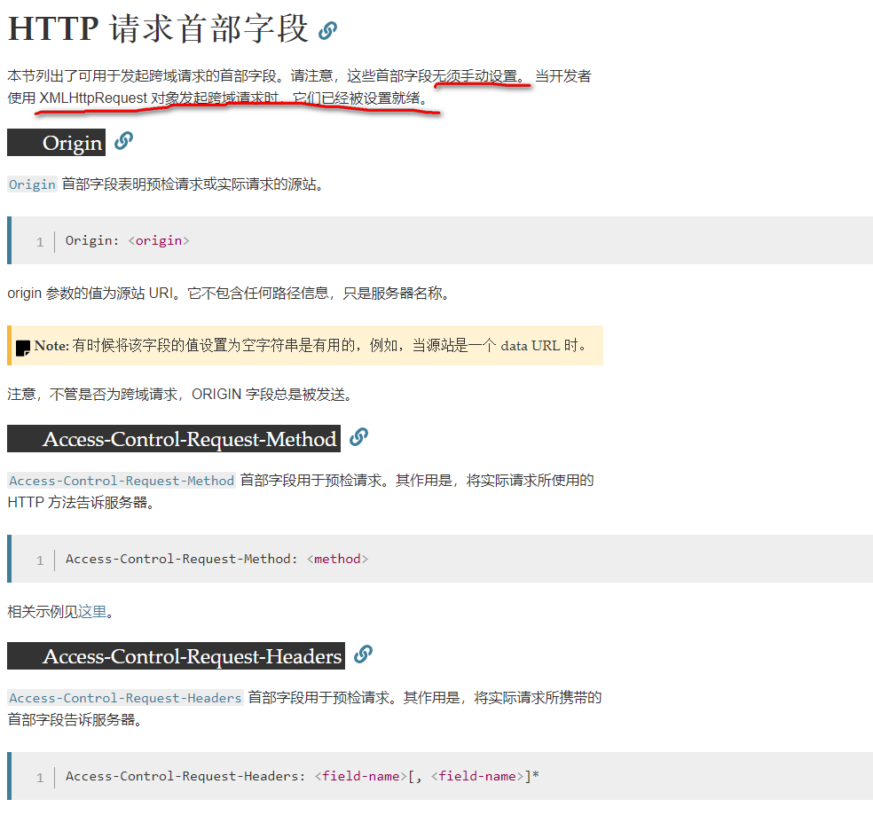
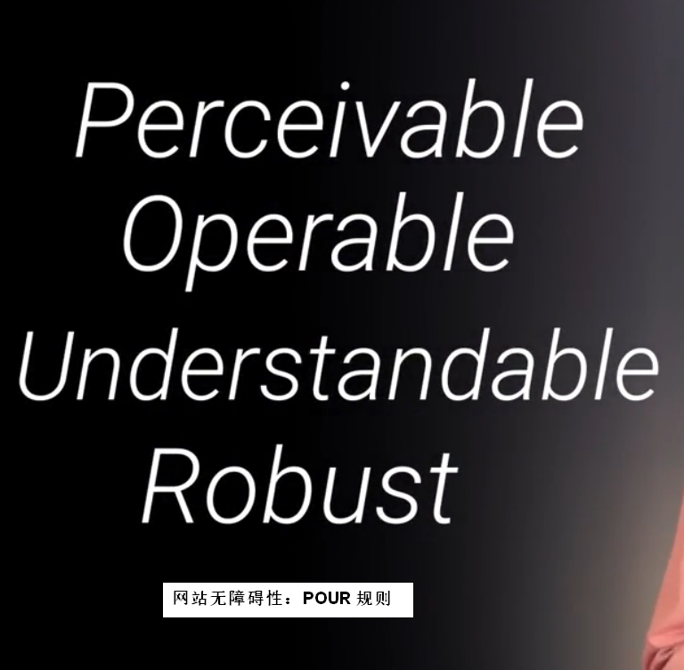
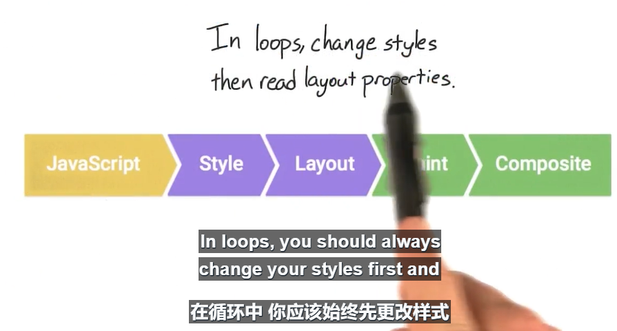
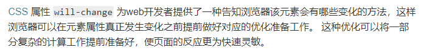
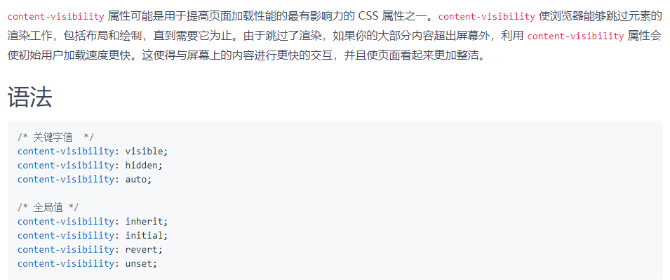
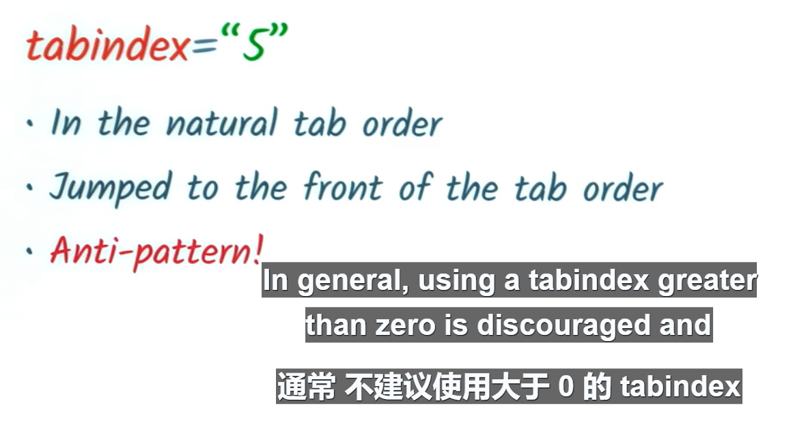
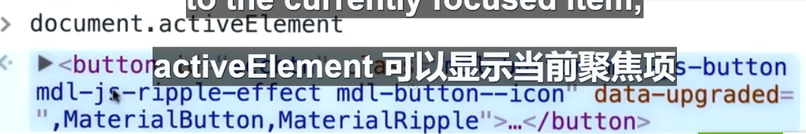

# 图片版

#### HTTP 请求首部字段

---

#### 网站无障碍性：POUR 规则

---

#### FSL 优化

---

#### CSS Will-Change 属性

---

#### Content-visibility 属性

---

#### CSS 选择器的特异性(优先级)

.png)

---

#### Tab-Index 建议

---

#### 显示当前聚焦项

