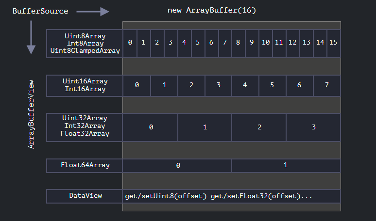

<!-- TOC -->

- [基础部分](#基础部分)
  - [变量提升](#变量提升)
  - [常见方法](#常见方法)
  - [类型判断](#类型判断)
  - [void 运算符](#void-运算符)
  - [泛型方法](#泛型方法)
  - [TypedArray](#typedarray)
  - [Binary Operators](#binary-operators)
  - [Blob](#blob)
- [Tip](#tip)
    - [FinalizationRegistry](#finalizationregistry)
    - [Object.preventExtensions](#objectpreventextensions)
    - [Object.seal](#objectseal)
    - [RegExp 的/g 死循环](#regexp-的g-死循环)
    - [尾调用优化](#尾调用优化)
    - [自定义 JSON 格式](#自定义-json-格式)

<!-- /TOC -->

[JS 比较表](https://dorey.github.io/JavaScript-Equality-Table/)

## 基础部分

### 变量提升

**所有变量都会被提升：声明会被移动到函数的开始处，而赋值在原处进行**

```js
//user defined
function foo() {
  console.log(tmp);
  if (false) {
    var tmp = 3;
  }
}
//program see
function foo() {
  var tmp;
  console.log(tmp);
  if (false) {
    tmp = 3;
  }
}
```

### 常见方法

```js
//Array------------------------------------------------------------------------
arr.splice(1, 2)    //remove 2 elements begin at index 1, (safely and anyIndexing)
arr.copyWithin(1, 2, 3) //move something in index [2, 3) to [1, 3-(2-1))
//Reg------------------------------------------------------------------------
/abc/   //加载时编译
new RegExp('abc')   //运行时编译
/^.$/u.test('的')    //正确匹配Unicode字符
//使用Reg时, 如果不是立即使用, 最好确定 reg.global == true 和 reg.lastIndex == 0;
//string------------------------------------------------------------------------
'abc'.slice(-2, -2)   //写负数会 加上字符串的长度 再slice。没法处理四字节字符
Array.from('😂😅').slice(0, 1).join('');  //依赖于字符串的可迭代特性（新特性）所以可以正确处理四字符
'的'.codePointAt(0)  //返回字符串对应位置的Unicode编号, 能正确处理四字节或两字节
String.fromCodePrint(134071)    //返回Unicode编号对应的字符串

let s1 = 'S\u0307\u0323'; // Ṩ, S + 上方点符号 + 下方点符号
let s2 = 'S\u0323\u0307'; // Ṩ, S + 下方点符号 + 上方点符号
s1 === s2; // 看着一样其实是 false
s1.normalize() === s2.normalize();  // true (“Unicode 规范化”算法)
//number------------------------------------------------------------------------
const clamp = (num: number, min: number, max: number) => Math.min(Math.max(num, min), max);
Number.EPSILON; // the minimum double number
```

### 类型判断

```js
// 可以判断区分出 Null/undefined/Array/Object
Object.prototypes.toString.call(undefined); //[object undefined]
Object.prototypes.toString.call(null); //[object null]
Object.prototypes.toString.call([]); //[object array]
Object.prototypes.toString.call(function () {}); //[object function]

// 不能区分 Null/Array/Object
typeof undefined; //undefined
typeof null; //object
typeof []; //object
typeof function () {}; //function

// 可以区分具体的Object
student instanceof Student; //true
leader instanceof Leader; //true
```

### void 运算符

```js
//执行但返回undefined
void (function () {
  return 1;
})(); //undefined
void 1 + 4; //undefined
```

### 泛型方法

```js
var Wine = Object.create(Object, {
  AddAge: function (years) {
    return (this.age += years);
  },
});
var john = { age: 51 };
Wine.prototype.AddAge.call(john, 3); //借助call, apply, bind等实现泛型
john.age; //54
```

### TypedArray



- `ArrayBuffer`是核心对象，是对固定长度的连续内存区域的引用
- 几乎任何对`ArrayBuffer`的操作，都需要一个视图(TypedArray/DataView)
- TypedArray 中我们无法`splice`/`concat`，因为是视图，并且 buffer 是固定的、连续的内存区域。我们所能做的就是分配一个零值

### Binary Operators
- 按位非`~a`  反转操作数的比特位，即0变成1，1变成0。对数值进行按位非操作的结果为`-(a + 1)`
- 左移`a << b`  将 a 的二进制形式向左移 b(< 32) 比特位，右边用0填充
- 有符号右移`a >> b`  将 a 的二进制表示向右移 b(< 32) 位，正数/负数左侧用0/1填充
- 无符号右移`a >>> b` 将 a 的二进制表示向右移 b(< 32) 位，左侧用0填充

```ts
// simulate Enum
const Enum = {
  Ele = 0b1,  // 0001
  Ele2 = 0b1 << 1,  // 0010
  Ele3 = 0b1 << 2, // 0100
  Ele4 = 0b1 << 3, // 0100
  Ele5 = Enum.Ele | Enum.Ele4, // 0101
}
const Con = Enum.Ele5;  // 0101
Con & Enum.Ele5;  // 0101 & 0101 = 1 true
Con & Enum.Ele4;  // 0101 & 0100 = 1 true

// round
Math.round(somenum) === 
  (0.5 + somenum) | 0 ===
  ~~(0.5 + somenum) ===
  (0.5 + somenum) << 0;
// floor
Math.floor(somenum) === somenum | 0;
```

### Blob

```js
const link = document.createElement('a');
link.download = 'hello.txt';

// 第一个参数必须是一个数组 [...]
const blob = new Blob(['Hello, world!'], {type: 'text/plain'});

// 从 blob 获取 arrayBuffer
const buffer = await blob.arrayBuffer();
// 从 blob 获取 readableStream
const readableStream = blob.stream();

// Blob 对象是不可改变的(如字符串对象)，但可以从旧的创建新的
const slicedBlob = blob.slice(0, blob.length, 'text/txt');

// objectURL 形式为 blob:<origin>/<uuid>
// 如；blob:https://javascript.info/1e67e00e-860d-40a5-89ae-6ab0cbee6273
link.href = URL.createObjectURL(slicedBlob);

link.click();

// 如果我们创建一个 URL，那么即使我们不再需要 Blob 了，它也会被挂在内存中。因此需要 revoke
URL.revokeObjectURL(link.href);
```

```js
// file 继承自 blob，所以 FileReader 一些方法可以处理 Blob
const reader = new FileReader();
reader.readAsDataURL(blob); // 将 Blob 转换为 base64 并调用 onload

reader.onload = function() {
  // data-url 的形式为 data:[<mediatype>][;base64],<data>
  // 如：data:text/plain;base64,SGVsbG8sIHdvcmxkIQ==
  link.href = reader.result; // data url
  link.click();
};
```

## Tip

#### FinalizationRegistry

```js
const registry = new FinalizationRegistry(heldValue => {
  // 当 obj 被垃圾回收时，这里(可能)会执行(依赖于具体引擎实现)
  console.log(heldValue); // 'some value'
});

// 监听一个对象被垃圾回收事件
registry.register(obj, "some value", objToken);

// 取消监听
// use obj itself as the unregister token (objToken), which is just fine
registry.unregister(objToken);
```

#### Object.preventExtensions

```js
var obj = function () {
  Object.preventExtensions(this);
};
Object.isExtensible(obj); //false
var m = new obj(); //m的属性不能被添加和修改了(可以删除). 除非调用了已经存在的API
```

#### Object.seal

```js
var obj = Object.create({}, { foo: { value: 1, enumerable: false } });
Object.seal(obj); //使得无法修改obj的属性(可迭代, 可写, 可配置)
Object.isSeled(obj); //true
obj.foo = "b"; //可以修改值
```

#### RegExp 的/g 死循环

```js
while(/a/g.test('baabaa')) count++;     //dead loop
while(/a/g.exec('abasbs')) count--;     //dead loop
//解决办法:
let reg = /a/g; //将reg提取出来
while(reg.test() || reg.exec())
```

#### 尾调用优化

```js
//未优化
function F() {
  return B() * 1;
}
function F() {
  var r = B() * 2;
  return r;
}
//优化
function F() {
  return B(2);
}
```

#### 自定义 JSON 格式

简而言之需要实现`toJSON`方法。该方法会在`JSON.stringify`时尝试调用

```js
const json = JSON.stringify({
  answer: { toJSON: () => 42 },
});
console.log(json); // {"answer":42}

class HTTPErr extends Error {
  constructor(message, status) {
    super(message);
    this.status = status;
  }

  toJSON() {
    return { message: this.message, status: this.status };
  }
}
const e = new HTTPError("Fail", 404);
console.log(JSON.stringify(e)); // {"message":"Fail","status":404}
```
