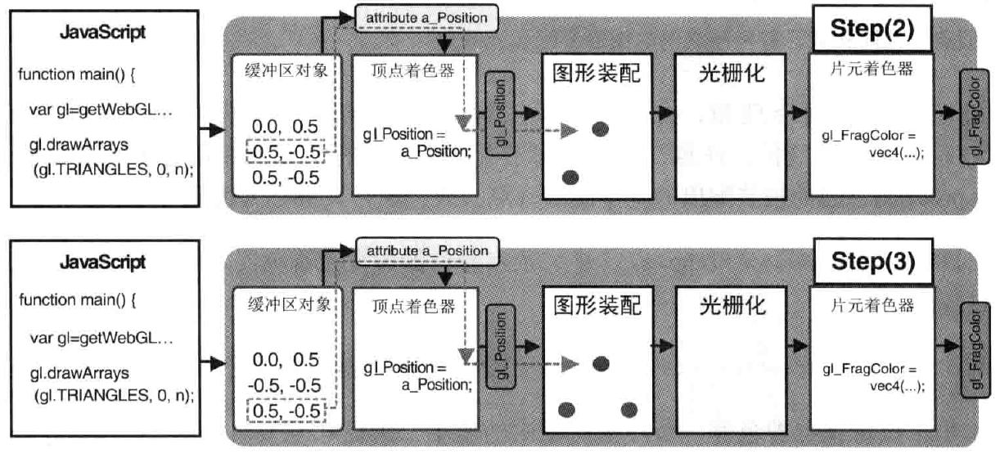

# WebGL
- WebGL内置于浏览器内, 基于`OpenGL ES 2.0`, 使用*GLSL ES*编写shader
- WebGL的颜色使用`0-1`
- WebGL的X轴水平向右, Y轴水平向下, Z轴水平向外
- WebGL不需要交换颜色缓冲区
- WebGL 的矩阵和 OpenGL 一样，是列主序

## 概念
- **WebGL**使用`<canvas></canvas>`元素绘制图形. canvas中, 无论2d还是3d都是由WebGL处理的
- **齐次坐标**指: `(x, y, z, w)`， 是个四维坐标. 等价于三维中的`(x/w, y/w, z/w)`

### OpenGL ES
- float变量必须加小数点. 如: `10.0`, <span style="color:red">Error</span>:`10`
- 对于*三维对象*, 使用**齐次坐标**来赋值

### 规范

> 函数规范

```js
 ctx.vertexAttrib    3      f     ();
|   基础函数名   |参数个数|参数类型|
```

> 变量规范

```js
//声明
 uniform     vec4 u_FColor;
| 存储限定符 |类型| 变量名 |
//名称
不能以gl/webgl开头
```

### 可绘制的基本图形

|基本图形|枚举值|描述|
|:-:|:-:|:-|
|点|ctx.POINTS|绘制在v0, v1, v2...处|
|线段|ctx.LINES|绘制在(v0, v1), (v2, v3), (v4, v5)...处<br>如果是奇数点, 忽略最后一个|
|线条|ctx.LINE_STRIP|连接起来的线段<br>绘制在(v0, v1), (v1, v2), (v2, v3)...处|
|回路|ctx.LINE_LOOP|与线条相比, 会连接(vN, v0)|
|三角形|ctx.TRIANGLES|绘制在(v1, v2, v3), (v4, v5, v6)...处<br>非3的倍数时, 最后几个点会被忽略|
|三角带|ctx.TRIANGLE_STRIP|绘制在(v0, v1, v2), (v2, v1, v3)...处<br>相邻两个三角形共享一条边|
|三角扇|ctx.TRIANGLE_FAN|绘制在(v0, v1, v2), (v0, v2, v3)...处<br>共用一个点的三角形组|

## 绘图
**WebGL和canvas的坐标系不同**


**WebGL的旋转**


### JS和Shader交互


> **attribute变量**传输与顶点有关的数据, 且只有*顶点着色器*能够使用

```js
// in shader
var VSHADER = `
    attribute vec4 a_Pos;   //attribute变量必须是全局变量
    void main(){
        gl_Position = a_Pos;
        gl_PointSize = 10.0;
    }
`;
// in js.
var ctx =  canvas.getContext("2d");
var a_Pos = ctx.getAttribLocation(ctx.program, 'a_Pos');    //获取变量地址, 赋值时需要该地址才能赋值成功
ctx.vertexAttrib3f(a_Pos, 0.0, 0.0, 0.0);   //赋值给shader中的a_Pos变量(第四位填1.0)
//ctx.vertexAttrib4f(...); also 1f, 2f(填0.0给2/3位);
//ctx.vertexAttrib4fv(.., new Float32Array([1, 2, 3, 1])); also 3fv, 2fv, 1fv
//float 用1f就行
```

> **uniform变量**传输对于所有顶点都相同(或与顶点无关)的数据, 或者传递给片元着色器

```js
// in shader
var FSHADER = `
    uniform vec4 u_FColor;   //uniform变量必须是全局变量
    void main(){
        gl_FragColor = u_FColor;
    }
`;
// in js.
var ctx =  canvas.getContext("2d");
var u_FColor = ctx.getUniformLocation(ctx.program, 'u_FColor');    //获取变量地址, 赋值时需要该地址才能赋值成功
ctx.uniform4f(u_FColor, 0.0, 0.0, 0.0, 1.0);    //和attribute的函数类似
```

> **varying变量**作用是从顶点着色器向片元着色器传输数据, 会产生内插过程即渐变效果<br/>
> 1. js中, 传递给attribute变量<br/>
> 2. 顶点着色器中, attribute变量赋值给varying变量<br/>
> 3. 片元着色器中, 使用varying变量<br/>

```js
//in shader
var VSHADER = `
    attribute vec4 a_Color;
    varying vec4 v_Color;
    void main(){
        v_Color = a_Color;  //向varying传数据
    }
`;
var FSHADER = `
    varying vec4 v_Color;   //也得声明, 已被内插作用
    void main(){
        gl_FragColor = v_Color; //从varying取数据
    }
`;
//in js
var ctx =  canvas.getContext("2d");
var a_Color = ctx.getAttribLocation(ctx.program, 'a_Color');    //获取变量地址, 赋值时需要该地址才能赋值成功
ctx.vertexAttrib3f(a_Color, 0.0, 0.0, 0.0);   //赋值给shader中的a_Pos变量
```

> 坐标转换

```js
var pagecod = [e.clientX, e.clientY];  //鼠标坐标 (页面坐标)
var rect = e.target.getBundingClientRect(); //canavs 原点坐标
var cancod = [pagecod[0]-rect.left, pagecod[1]-rect.top];   //转换为canvas坐标
var glcod = [(cancod[0] - canvas.width/2)/(canvas.width/2), (canvas.height/2 - cancod[1])/(canvas.height/2);    //webgl坐标
```

```js
var radian = Math.PI * Angle /180;  //角度转弧度
var cosB = Math.cos(radian), sinB = Math.sin(radian);
var moveX, moveY, moveZ;
var rSizeX, rSizeY, rSizeZ;
var xformMatrix = new Float32Array([    //WebGL 的矩阵是列主序。转为正常矩阵需要转置
    rSizeX * cosB, sinB, 0.0, 0.0,
    -sinB, rSizeY * cosB, 0.0, 0.0,
    0.0, 0.0, rSizeZ * 1.0, 0.0,
    moveX, moveY, moveZ, 1.0,
])
```
## 概览
### 顶点着色器


```js
var VSHADER_SOURCE = `
    void main(){
        gl_Position = vec4(0.0, 0.0, 0.0, 1.0); //设置坐标
        gl_PointSize = 10.0;     //设置尺寸
    }
`;
```
### 片元着色器


```js
var FSHADER_SOURCE = `
    void main(){
        //gl_FragColor是片元着色器的唯一变量, 用于指定片元颜色
        gl_FragColor = vec4(1.0, 0.0, 0.0, 1.0); //设置颜色
    }
`;
```
### 缓冲区对象
> JS只能写数据到缓冲区，而 WebGL 可以从缓冲区读数据

```js
function initVertexBuffers(ctx){
    var vertices = new Float32Array(6); //需要写的数据
    var n = 3;  //缓冲区中点的个数
    var vBuffer = ctx.createBuffer();   //创建缓冲区 deleteBuffer(vBuffer)
    if(!vBuffer) return;
    ctx.bindBuffer(ctx.ARRAY_BUFFER, vBuffer);  //绑定缓冲区对象(target, buffer)
    ctx.bufferData(ctx.ARRAY_BUFFER, vertices, ctx.STATIC_DRAW);    //写入数据到"缓冲区对应目标"(ctx.ARRAY_BUFFER)
    var a_Pos = ctx.getAttribLocation(ctx.program, 'a_Pos');//插入shader所需变量
    ctx.vertexAttribPointer(a_Pos, 2, ctx.FLOAT, false, 0, 1);  //将缓冲区对象分配给a_Pos(从第1个数据开始, 每隔0个数据, 每次分配float*2)
    ctx.enableVertexAttribArray(a_Pos); //连接a_Pos与分配给它的缓冲区对象 disable...Array();
    return n;
}
```
### 调用流程
```js
function main(){
    var canvas = document.getElementById("canvas");
    if(!canvas) return; //获取canvas
    var ctx = canvas.getContext("2d");
    if(!initShaders(gl, VSHADER_SOURCE, FSHADER_SOURCE)) return;    //初始化着色器(函数细节之后章节会讲)
    initVertexBuffers(ctx); //设置顶点位置(缓冲区) 及 js-shader交互
    ctx.clearColor(0.0, 0.0, 0.0, 1);   //设置canvas背景色
    ctx.clear(ctx.COLOR_BUFFER_BIT);    //使用背景色填充canvas
    ctx.drawArrays(ctx.POINTS, 0, n);   //绘图(从第0个点绘制3次)
}
```
