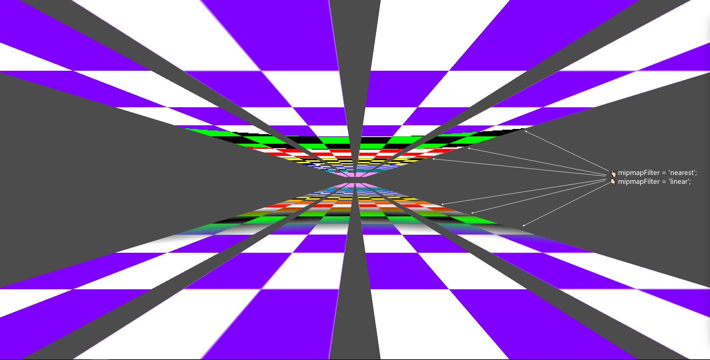
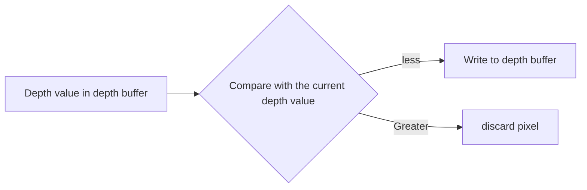

- [Mipmap](#mipmap)
- [深度](#深度)
  - [深度图](#深度图)
  - [深度测试](#深度测试)
- [绘制顺序](#绘制顺序)

## Mipmap

因为 Texture UV 是浮点数，而 pixel 是整数，因此在采样 UV 颜色生成 pixel 时，会[产生闪烁](https://webgpufundamentals.org/webgpu/lessons/webgpu-textures.html#:~:text=minFilter)。解决方法就是使用较小的 Texture 去处理(颜色已经人为混合，更为集中单一，因此采样后混合的颜色*看上去*不会闪烁)

Mipmap 生成过程：用纹理创建一个更小的纹理，每个维度都是一半大小，四舍五入。然后用第一个原始纹理的混合颜色填充较小的纹理。重复这个过程，直到得到 1x1 的纹理。如：假设有一个 5x7 的纹理。首先在每个维度上除以 2，然后四舍五入得到一个 2x3 的纹理。重复，直到得到 1x1 的纹理。

而 Mipmap 也有新问题。当处于特定的显示规格尺寸不上不下，Mipmap 不能取大的也不能取小的时，GPU 就需要混合两个 Mipmap。因此有 linear/nearest 的采样区分。Nearest 的在混合时点的变化突然，有锯齿，但是仅用采样 1 UV 性能高；Linear 的在混合时变化有模糊感，看着更为自然，但是需要采样 8 UV 性能更差(3d 时需要 16 UV)

## 深度

### 深度图

Near ~ Far, [0, 1] 的非线性(NDC空间)黑白图像，存储深度信息

离摄像机越远，深度值精度越低

$$
\begin{aligned}
           depth &= 0.5z^{''} + 0.5\\
                 &= \frac{f}{f-n} + \frac{2fn}{z(f-n)}\\
          linear &= \frac{1}{depth\frac{n-f}{fn} + \frac{1}{n}}\\
normalizedLinear &= \frac{1}{depth\frac{n-f}{n} + \frac{f}{n}}\\
                 &= \frac{linear}{f}
\end{aligned}
$$

其中

- $z^{''}$: NDC 空间的 z 值
- f: 远平面坐标
- n: 近平面坐标

### 深度测试

深度缓冲区: 存储每个像素的最浅深度，分辨率=最终输出分辨率

## 绘制顺序

1. 不透明和半透明物体同时存在时，先绘制*不透明*物体，再绘制*半透明*物体
   - 保证颜色混合
2. 绘制*半透明*物体时，**从远到近**进行绘制
   - 使用油画家算法(Painter's algorithm)
3. 绘制*不透明*物体时，**从近到远**进行绘制
   - 需要环境支持提前深度测试

常见颜色混合公式

$finalRGB = srcRGB \cdot srcAlpha + dstRGB \cdot (1-srcAlpha)$
