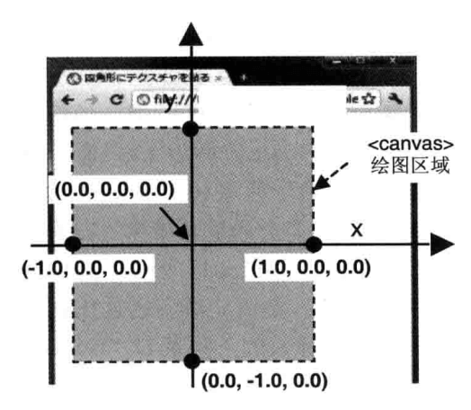
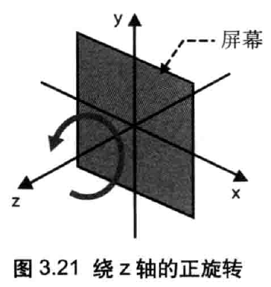
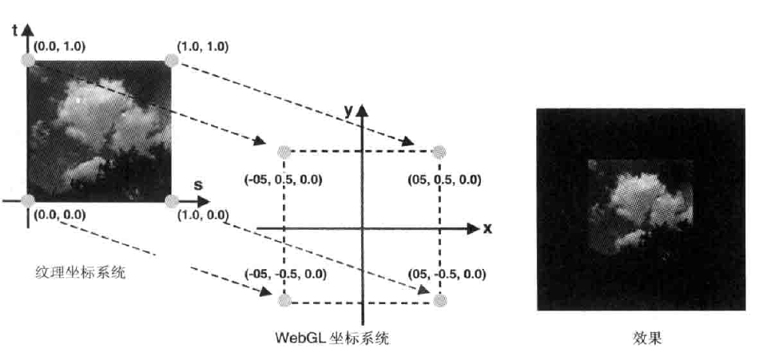
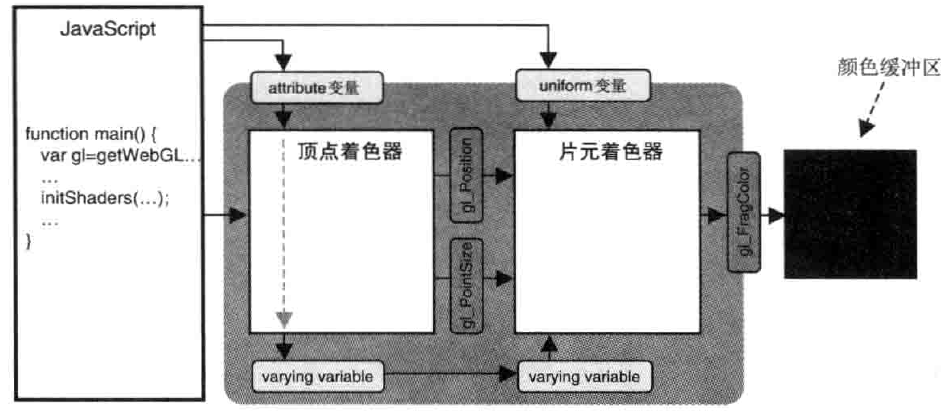
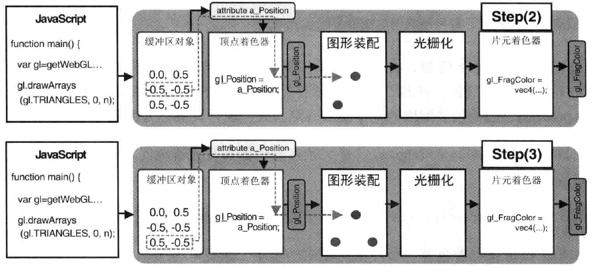
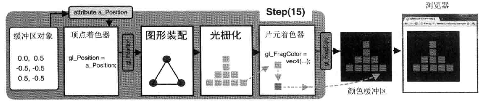

# WebGL

<!-- TOC -->

- [概念](#概念)
  - [可绘制的基本图形](#可绘制的基本图形)
- [绘图](#绘图)
- [JS 和 Shader 交互](#js-和-shader-交互)
- [概览](#概览)
  - [顶点着色器](#顶点着色器)
  - [片元着色器](#片元着色器)
  - [缓冲区对象](#缓冲区对象)
  - [调用流程](#调用流程)

<!-- /TOC -->

[Three.js](../Threejs/README.md)
[纹理映射的示例程序](./TextureQuad.md)
[OpenGL ES](./OpenGL%20ES.md)

- WebGL 内置于浏览器内, 基于`OpenGL ES 2.0`, 使用*GLSL ES*编写 shader
- WebGL 的颜色使用`0-1`
- WebGL 的 X 轴水平向右, Y 轴水平向下, Z 轴水平向外
- WebGL 不需要交换颜色缓冲区
- WebGL 的矩阵和 OpenGL 一样，是列主序
- WebGL 不允许加载跨域的纹理图像资源
- WebGL 使用"纹理单元"来管理和加载纹理. 默认的有 8 个纹理单元

## 概念

- **WebGL**使用`<canvas></canvas>`元素绘制图形. canvas 中, 无论 2d 还是 3d 都是由 WebGL 处理的
- canvas 中，如果裁切面的宽高比和 canvas 不同，将按照 canvas 的进行压缩，物体会被扭曲
- **齐次坐标**指: `(x, y, z, w)`， 是个四维坐标. 等价于三维中的`(x/w, y/w, z/w)`
- 观察者所处的位置称为**视点(eye point)**，从视点出发沿着观察方向的射线称为**视线(viewing direction)**

### 可绘制的基本图形

| 基本图形 |       枚举值       | 描述                                                                       |
| :------: | :----------------: | :------------------------------------------------------------------------- |
|    点    |     ctx.POINTS     | 绘制在 v0, v1, v2...处                                                     |
|   线段   |     ctx.LINES      | 绘制在(v0, v1), (v2, v3), (v4, v5)...处<br>如果是奇数点, 忽略最后一个      |
|   线条   |   ctx.LINE_STRIP   | 连接起来的线段<br>绘制在(v0, v1), (v1, v2), (v2, v3)...处                  |
|   回路   |   ctx.LINE_LOOP    | 与线条相比, 会连接(vN, v0)                                                 |
|  三角形  |   ctx.TRIANGLES    | 绘制在(v1, v2, v3), (v4, v5, v6)...处<br>非 3 的倍数时, 最后几个点会被忽略 |
|  三角带  | ctx.TRIANGLE_STRIP | 绘制在(v0, v1, v2), (v2, v1, v3)...处<br>相邻两个三角形共享一条边          |
|  三角扇  |  ctx.TRIANGLE_FAN  | 绘制在(v0, v1, v2), (v0, v2, v3)...处<br>共用一个点的三角形组              |

## 绘图

**WebGL 和 canvas 的坐标系不同**



**WebGL 的旋转**



**WebGL 的纹理坐标**



**注意**:WebGL 纹理坐标中的 t 轴方向和 PNG/BMP/JPG 等格式的坐标系统的 Y 轴方向是相反的. 因此加载这些纹理之前需要做 Y 轴翻转才能正确映射

## JS 和 Shader 交互



> **attribute 变量**传输与顶点有关的数据, 且只有*顶点着色器*能够使用

```js
// in shader
var VSHADER = `
    attribute vec4 a_Pos;   //attribute变量必须是全局变量
    void main(){
        gl_Position = a_Pos;
        gl_PointSize = 10.0;
    }
`;
// in js.
var ctx = canvas.getContext("2d");
var a_Pos = ctx.getAttribLocation(ctx.program, "a_Pos"); //获取变量地址, 赋值时需要该地址才能赋值成功
ctx.vertexAttrib3f(a_Pos, 0.0, 0.0, 0.0); //赋值给shader中的a_Pos变量(第四位填1.0)
//ctx.vertexAttrib4f(...); also 1f, 2f(填0.0给2/3位);
//ctx.vertexAttrib4fv(.., new Float32Array([1, 2, 3, 1])); also 3fv, 2fv, 1fv
//float 用1f就行
```

> **uniform 变量**传输对于所有顶点都相同(或与顶点无关, 如变换矩阵)的数据, 或者传递给片元着色器

```js
// in shader
var FSHADER = `
    uniform vec4 u_FColor;   //uniform变量必须是全局变量
    void main(){
        gl_FragColor = u_FColor;
    }
`;
// in js.
var ctx = canvas.getContext("2d");
var u_FColor = ctx.getUniformLocation(ctx.program, "u_FColor"); //获取变量地址, 赋值时需要该地址才能赋值成功
ctx.uniform4f(u_FColor, 0.0, 0.0, 0.0, 1.0); //和attribute的函数类似
```

> **varying 变量**作用是从顶点着色器向片元着色器传输数据, 会产生内插过程即渐变效果<br/>
>
> 1. js 中, 传递给 attribute 变量<br/>
> 2. 顶点着色器中, attribute 变量赋值给 varying 变量<br/>
> 3. 片元着色器中, 使用 varying 变量<br/>
> 4. 必须在两个着色器中声明同类型、同名的 varying 变量<br/>

```js
//in shader
var VSHADER = `
    attribute vec4 a_Color;
    varying vec4 v_Color;
    void main(){
        v_Color = a_Color;  //向varying传数据
    }
`;
var FSHADER = `
    varying vec4 v_Color;   //也得声明, 已被内插作用
    void main(){
        gl_FragColor = v_Color; //从varying取数据
    }
`;
//in js
var ctx = canvas.getContext("2d");
var a_Color = ctx.getAttribLocation(ctx.program, "a_Color"); //获取变量地址, 赋值时需要该地址才能赋值成功
ctx.vertexAttrib3f(a_Color, 0.0, 0.0, 0.0); //赋值给shader中的a_Pos变量
```

> 坐标转换

```js
var pagecod = [e.clientX, e.clientY];  //鼠标坐标 (页面坐标)
var rect = e.target.getBundingClientRect(); //canavs 原点坐标
var cancod = [pagecod[0]-rect.left, pagecod[1]-rect.top];   //转换为canvas坐标
var glcod = [(cancod[0] - canvas.width/2)/(canvas.width/2), (canvas.height/2 - cancod[1])/(canvas.height/2);    //webgl坐标
```

> 变换矩阵

```js
var radian = (Math.PI * Angle) / 180; //角度转弧度
var cosB = Math.cos(radian),
  sinB = Math.sin(radian);
var moveX, moveY, moveZ;
var rSizeX, rSizeY, rSizeZ;
var xformMatrix = new Float32Array([
  //WebGL 的矩阵是列主序。转为正常矩阵需要转置
  rSizeX * cosB,
  sinB,
  0.0,
  0.0,
  -sinB,
  rSizeY * cosB,
  0.0,
  0.0,
  0.0,
  0.0,
  rSizeZ * 1.0,
  0.0,
  moveX,
  moveY,
  moveZ,
  1.0,
]);
// 对象坐标 = 投影矩阵 * 视图矩阵 * 变换矩阵 * 原始顶点坐标
```

## 概览

### 顶点着色器



```js
var VSHADER_SOURCE = `
    void main(){
        gl_Position = vec4(0.0, 0.0, 0.0, 1.0); //设置坐标
        gl_PointSize = 10.0;     //设置尺寸
    }
`;
```

### 片元着色器



```js
var FSHADER_SOURCE = `
    void main(){
        //gl_FragColor是片元着色器的唯一变量, 用于指定片元颜色
        gl_FragColor = vec4(1.0, 0.0, 0.0, 1.0); //设置颜色
    }
`;
```

### 缓冲区对象

> JS 只能写数据到缓冲区，而 WebGL 可以从缓冲区读数据<br/> > **注意**: ARRAY_BUFFER 并不是只能有一块叫 ARRAY_BUFFER，而是一类 BUFFER 的统称。也就是说可以开辟同样类型的 BUFFER 多次写入不同数据

```js
function initVertexBuffers(ctx) {
  //建模软件生成vertices, indices, 准备数据
  var vertices = new Float32Array(6); //顶点、颜色等信息
  var indices = new Uint8Array([0, 0, 0]); //顶点索引(drawElements需要)
  //缓冲区中点的个数, drawElement是: indices.length/ drawArray是: vertices.length
  var n = 3;
  //创建缓冲区 deleteBuffer(vBuffer), 数据写区域
  var vBuffer = ctx.createBuffer();
  var iBuffer = ctx.createBuffer();
  if (!vBuffer || !iBuffer) return;
  //绑定并写入数据
  ctx.bindBuffer(ctx.ARRAY_BUFFER, vBuffer); //绑定缓冲区对象(target, buffer)
  ctx.bufferData(ctx.ARRAY_BUFFER, vertices, ctx.STATIC_DRAW); //写入数据到"缓冲区对应目标"(ctx.ARRAY_BUFFER)
  ctx.bindBuffer(ctx.ELEMENT_ARRAY_BUFFER, iBuffer);
  ctx.bufferData(ctx.ELEMENT_ARRAY_BUFFER, indices, ctx.STATIC_DRAW);
  //插入shader所需变量, ARRAY_BUFFER中数据
  var a_Pos = ctx.getAttribLocation(ctx.program, "a_Pos");
  ctx.vertexAttribPointer(a_Pos, 2, ctx.FLOAT, false, 0, 1); //将缓冲区分配给a_Pos(从第1个数据开始, 每隔0个数据, 每次分配float*2)
  ctx.enableVertexAttribArray(a_Pos); //连接a_Pos与分配给它的缓冲区对象 disable...Array();
  return n;
}
```

### 调用流程

```js
function main() {
  var canvas = document.getElementById("canvas");
  if (!canvas) return; //获取canvas
  var ctx = canvas.getContext("2d");
  if (!initShaders(gl, VSHADER_SOURCE, FSHADER_SOURCE)) return; //初始化着色器(函数细节之后章节会讲)
  initVertexBuffers(ctx); //设置顶点位置(缓冲区) 及 js-shader交互
  ctx.enable(ctx.DEPTH_TEST); //开启GPU功能，如深度测试等
  ctx.clearColor(0.0, 0.0, 0.0, 1); //设置canvas背景色
  ctx.clear(ctx.COLOR_BUFFER_BIT | ctx.DEPTH_BUFFER_BIF); //清空上一帧的遗留
  ctx.drawArrays(ctx.POINTS, 0, n); //绘图(从第0个点绘制3次)
  //ctx.drawElements(ctx.TRIANGLES, n, ctx.UNSIGNED_BYTE, offset)
  //绘图(使用ctx.ELEMENT_ARRAY_BUFFER的顶点索引offset后绘制n个顶点). 目的是减少顶点个数
}
```
