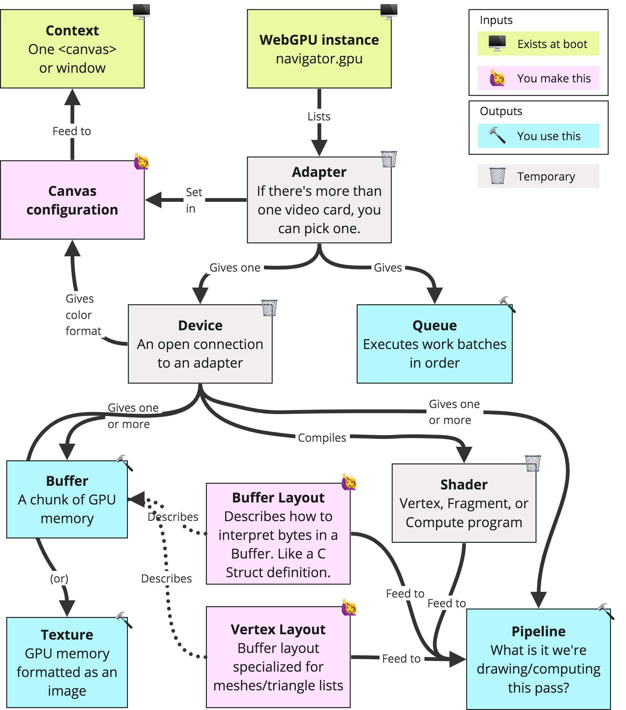

- [调用过程](#调用过程)
  - [准备硬件环境](#准备硬件环境)
  - [准备软件环境](#准备软件环境)
  - [映射数据](#映射数据)
  - [渲染 + 读取数据](#渲染--读取数据)

## 调用过程



### 准备硬件环境

```js
// webgpu 通过adapter抽象出物理GPU实例
const adapter = await navigator.gpu?.requestAdapter();
// adapter通过device来通用化GPU接口
const device = await adapter?.requestDevice();
if (!device) {
  fail("need a browser that supports WebGPU");
  return;
}
device.lost.then(() => {
  throw new Error();
});

// WebGPU通过canvas画图，所以需要配置它
const canvas = document.querySelector("canvas");
const context = canvas.getContext("webgpu");
// 需要请求GPU的颜色格式: rgba8unorm or bgra8unorm (不影响shader中的颜色格式，GPU会自动转换)
const presentationFormat = navigator.gpu.getPreferredCanvasFormat();
context.configure({
  device,
  format: presentationFormat,
});
```

### 准备软件环境

Shader 函数：类似于 js 中的 forEach 函数。Vertex 是对每次渲染过程调用生成顶点(光栅化后 GPU 丢弃不需要的渲染的 pixel)；Fragment 对光栅化后的每个像素做迭代生成(通常是颜色/或者是深度图)

渲染画布尺寸：WebGPU 的空间是裁剪的标准化空间(长宽都是[-1,1])

```js
// module用以准备GPU所需的shader内容，以交给CPU翻译给GPU执行
const module = device.createShaderModule({
  label: "some label",
  code: "WGSL (WebGPU Shading Language)",
});

// pipeline用于连接硬件和软件
const pipeline = device.createRenderPipeline({
  label: "some label",
  // gpu的buffer格式
  layout: "auto",
  vertex: {
    module,
    // vertex shader的入口函数
    entryPoint: "vs",
  },
  fragment: {
    module,
    // fragment shader的入口函数
    entryPoint: "fs",
    // 指定渲染的格式。在shader中以@location(index)表示
    targets: [{ format: presentationFormat }],
  },
  /* GPGPU的设置
  compute: {
    module,
    entryPoint: 'computeSomething',
  },
  */
});

// 描述需要填充的纹理及其处理
const renderPassDescriptor = {
  label: "our basic canvas renderPass",
  // 在shader中以@location(index)表示
  colorAttachments: [
    {
      // filled color 未渲染时填充色
      clearValue: [0.3, 0.3, 0.3, 1],
      // 指定渲染前clear the texture to the clear value
      loadOp: "clear",
      // 存储或丢弃渲染结果
      storeOp: "store",
    },
  ],
};

// GPU 的CommandEncoder相当于程序的compiler
const encoder = device.createCommandEncoder({ label: "our encoder" });
```

### 映射数据

```js
// GPU 程序的副作用
const input = new Float32Array([1, 3, 5]);
// GPU buffer 缓冲区(缓冲区不能立即从GPU可读，需要另行映射)
const workBuffer = device.createBuffer({
  label: "work buffer",
  size: input.byteLength,
  usage:
    GPUBufferUsage.STORAGE | GPUBufferUsage.COPY_SRC | GPUBufferUsage.COPY_DST,
});
// 申请 GPU buffer 缓冲区 填充 js buffer 数据
// 注意 queue 是懒执行的。只会在 submit 后读取 buffer。因此在 submit 前修改同一 buffer 的动作都会起效
device.queue.writeBuffer(workBuffer, 0, input);

// 连接此次render pass和缓冲区
const bindGroup = device.createBindGroup({
  label: "bindGroup for work buffer",
  layout: pipeline.getBindGroupLayout(0),
  entries: [{ binding: 0, resource: { buffer: workBuffer } }],
});

// 映射缓冲区数据到js buffer。resultBuffer 可以在缓冲区写入后可读
const resultBuffer = device.createBuffer({
  label: "result buffer",
  size: input.byteLength,
  usage: GPUBufferUsage.MAP_READ | GPUBufferUsage.COPY_DST,
});
```

### 渲染 + 读取数据

```js
// view将呈现出最终的渲染效果
// 和adapter是对物理GPU的抽象一样，view是对软件渲染界面的抽象
renderPassDescriptor.colorAttachments[0].view = context
  .getCurrentTexture()
  .createView();

// 连接render pass(源码)，并调用
const pass = encoder.beginRenderPass(renderPassDescriptor);
pass.setPipeline(pipeline);
pass.setBindGroup(0, bindGroup); // map buffer group
pass.dispatchWorkgroups(input.length); // call compute shader 3 times
pass.draw(3, 2); // call our vertex shader 3 * 2 times (per 2 obj, 3 times)
// render pass 完成，准备提交
pass.end();

// 告诉GPU完成后需要读取数据
encoder.copyBufferToBuffer(workBuffer, 0, resultBuffer, 0, resultBuffer.size);

// 编译设置完成
const commandBuffer = encoder.finish();
// 提交渲染过程，执行程序
device.queue.submit([commandBuffer]);

// 读取数据
await resultBuffer.mapAsync(GPUMapMode.READ);
const result = new Float32Array(resultBuffer.getMappedRange());

console.log("input", input);
console.log("result", result);

// unmap会手动释放掉这块内存，使得GPU/js数据层可以解耦
resultBuffer.unmap();
```
