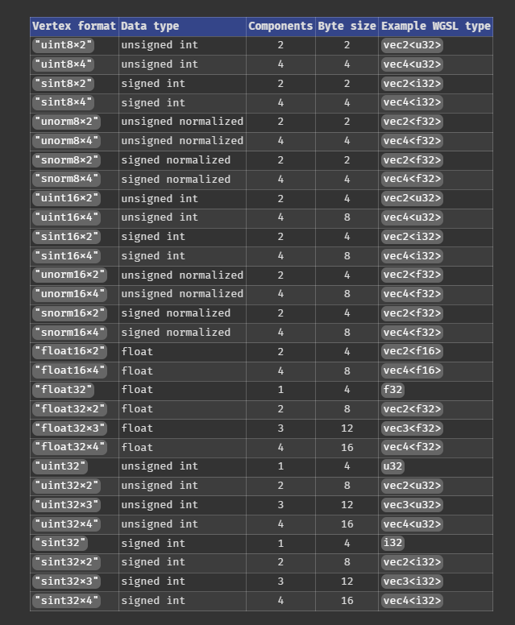
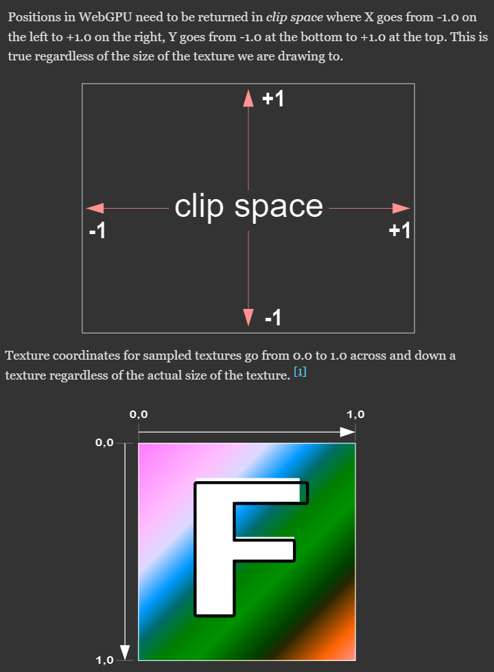
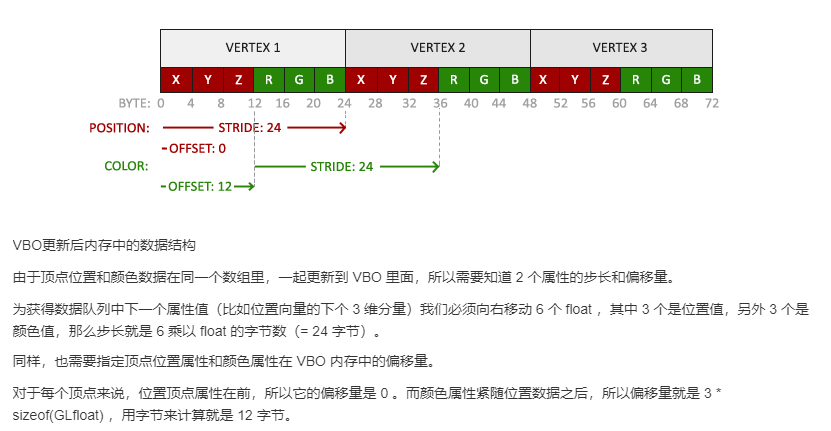
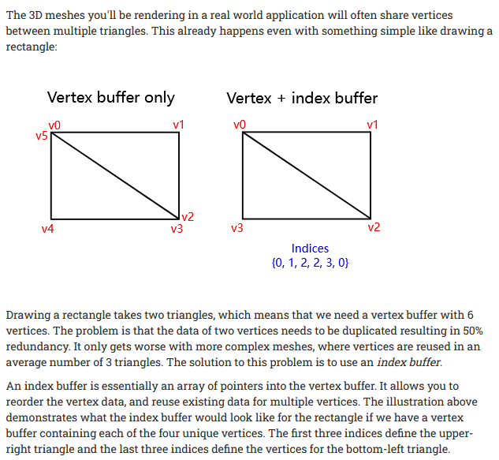

- [调用过程](#调用过程)
  - [准备硬件环境](#准备硬件环境)
  - [准备软件环境](#准备软件环境)
  - [映射数据](#映射数据)
  - [映射 Texture/Sampler](#映射-texturesampler)
  - [渲染 + 读取数据](#渲染--读取数据)
- [Trivia](#trivia)
  - [Mipmap](#mipmap)
  - [Format](#format)
  - [Coordinates](#coordinates)
  - [Stride](#stride)
  - [Why Index Buffer](#why-index-buffer)

https://github.com/gpuweb/gpuweb/wiki/Implementation-Status

## 调用过程


### 准备硬件环境

```js
// webgpu 通过adapter抽象出物理GPU实例
const adapter = await navigator.gpu?.requestAdapter();
// adapter通过device来通用化GPU接口
// 这里参数会告诉你GPU的bindGroup限制、Texture限制、StorageBuffer限制等
const device = await adapter?.requestDevice();
if (!device) {
  fail("need a browser that supports WebGPU");
  return;
}
device.lost.then(() => {
  throw new Error();
});

// WebGPU通过canvas画图，所以需要配置它
const canvas = document.querySelector("canvas");
const context = canvas.getContext("webgpu");
// 需要请求GPU的颜色格式: rgba8unorm or bgra8unorm (不影响shader中的颜色格式，GPU会自动转换)
// unorm 指 unsigned normalized，表识值将从 (0 to 255) 转为 (0.0 to 1.0)
const presentationFormat = navigator.gpu.getPreferredCanvasFormat();
context.configure({
  device,
  format: presentationFormat,
});
```

### 准备软件环境

Shader 函数：类似于 js 中的 forEach 函数。Vertex 是对每次渲染过程调用生成顶点(光栅化后 GPU 丢弃不需要的渲染的 pixel)；Fragment 对光栅化后的每个像素做迭代生成(通常是颜色/或者是深度图)

渲染画布尺寸：WebGPU 的空间是裁剪的标准化空间(长宽都是[-1,1])

```js
// module用以准备GPU所需的shader内容，以交给CPU翻译给GPU执行
const module = device.createShaderModule({
  label: "some label",
  code: "WGSL (WebGPU Shading Language), based On Vulkan SPIR-V Standard",
});

// pipeline用于连接硬件和软件
const pipeline = device.createRenderPipeline({
  label: "some label",
  // gpu的buffer格式。表明 GPU 如何读取 CPU 数据
  layout: "auto",
  vertex: {
    module,
    // vertex shader的入口函数
    entryPoint: "vs",
    // vertex buffer 配置。vertex buffer 不需要bindingGroup，这是它的平替
    buffers: [
      {
        arrayStride: 2 * 4, // vec2f, 2 floats, 4 bytes **each**
        attributes: [
          { shaderLocation: 0, offset: 0, format: "float32x2" }, // position
        ],
      },
    ],
  },
  fragment: {
    module,
    // fragment shader的入口函数
    entryPoint: "fs",
    // 指定渲染的格式。在shader中以@location(index)表示
    targets: [{ format: presentationFormat }],
  },
  primitive: {
    // GPU 绘制格式。默认光栅化为 三角形(还有 line/line-strip/point/point-list/triangle-strip)
    topology: "triangle-list"
  },
  /* GPGPU的设置
  compute: {
    module,
    entryPoint: 'computeSomething',
  },
  */
});

// 描述需要填充的纹理及其处理
const renderPassDescriptor = {
  label: "our basic canvas renderPass",
  // 在shader中以@location(index)表示
  colorAttachments: [
    {
      // filled color 未渲染时填充色
      clearValue: [0.3, 0.3, 0.3, 1],
      // 指定渲染前clear the texture to the clear value
      loadOp: "clear",
      // 存储或丢弃渲染结果
      storeOp: "store",
    },
  ],
};

// GPU 的CommandEncoder相当于程序的compiler。将准备好的指令写入到 GPU 的 CommandBuffer 中
const encoder = device.createCommandEncoder({ label: "our encoder" });
```

### 映射数据

```js
// GPU 程序的副作用
const input = new Float32Array([1, 3, 5]);
// GPU buffer 缓冲区(缓冲区不能立即从GPU可读，需要另行映射)
const workBuffer = device.createBuffer({
  label: "work buffer",
  size: input.byteLength,
  usage:
    GPUBufferUsage.STORAGE | GPUBufferUsage.COPY_SRC | GPUBufferUsage.COPY_DST,
});
// 申请 GPU buffer 缓冲区 填充 js buffer 数据
// 注意 queue 是懒执行的。只会在 submit 后读取 buffer。因此在 submit 前修改同一 buffer 的动作都会起效
device.queue.writeBuffer(workBuffer, 0, input);

// 连接此次render pass和缓冲区
const bindGroup = device.createBindGroup({
  label: "bindGroup for work buffer",
  layout: pipeline.getBindGroupLayout(0),
  entries: [{ binding: 0, resource: { buffer: workBuffer } }],
});

// 映射缓冲区数据到js buffer。resultBuffer 可以在缓冲区写入后可读
const resultBuffer = device.createBuffer({
  label: "result buffer",
  size: input.byteLength,
  usage: GPUBufferUsage.MAP_READ | GPUBufferUsage.COPY_DST,
});
```

### 映射 Texture/Sampler

Texture 就是特殊的 Uint8Array 的 storage buffer，步骤类似，但是接口不同

```js
const _ = [255,   0,   0, 255];  // red
const y = [255, 255,   0, 255];  // yellow
const b = [  0,   0, 255, 255];  // blue
// 由于Texture的原点和canvas的座标原点不在一个位置，通常Texture需要翻转以适应Canvas
const textureData = new Uint8Array([
  // 1. 手动翻转
  _, _, _, _, _,
  _, y, _, _, _,
  _, y, _, _, _,
  _, y, y, _, _,
  _, y, _, _, _,
  _, y, y, y, _,
  b, _, _, _, _,
  // 2. vertex shader: texcoord = vec2f(xy.x, 1.0 - xy.y);
  // 3. fragment shader: texcoord = vec2f(fsInput.texcoord.x, 1.0 - fsInput.texcoord.y);
].flat());  // notice the flat function
const mips = generateMips(textureData, kTextureWidth);  //生成 mipmap
const texture = device.createTexture({
  size: [mips[0].width, mips[0].height],
  mipLevelCount: mips.length,
  format: 'rgba8unorm',
  usage: GPUTextureUsage.TEXTURE_BINDING | GPUTextureUsage.COPY_DST,
});
mips.forEach(({data, width, height}, mipLevel) => {
  // 写入所有的mipmapData
  device.queue.writeTexture(
    // mipLevel 配合 mipLevelCount，WebGPU 才会正确处理mipmap
    { texture, mipLevel },
    data,
    // pixel(texel) 宽度
    { bytesPerRow: width * 4 },
    // texture数据flat了，所以要表明长宽数据
    { width, height },
  );
});
// 自己控制的 sampler。处理mipmap, uv插值等
const sampler = device.createSampler();
const bindGroup = device.createBindGroup({
  layout: pipeline.getBindGroupLayout(0),
  entries: [
    { binding: 0, resource: sampler },
    { binding: 1, resource: texture.createView() },
  ],
});

// 也可以 Omit bitmaps/writeTexture/createBindGroup，直接用一个 API。WebGPU会内部处理这些
device.queue.copyExternalImageToTexture(
  { source: textureData },
  { texture: texture },
  [textureData.width, textureData.height]
);
```

### 渲染 + 读取数据

```js
// view将呈现出最终的渲染效果
// 和adapter是对物理GPU的抽象一样，view是对软件渲染界面的抽象
renderPassDescriptor.colorAttachments[0].view = context
  .getCurrentTexture()
  .createView();

// 连接render pass(源码)，并调用
const pass = encoder.beginRenderPass(renderPassDescriptor);
pass.setViewport(0, 0, canvas.clientWidth, canvas.clientHeight, 0, 1);  //可以不调用，默认就是这样。但可以改
pass.setPipeline(pipeline);
pass.setBindGroup(0, bindGroup); // map buffer group
pass.setVertexBuffer(0, vertexBuffer); //设置 vertexBuffer (@location, buffer)
pass.setIndexBuffer(indexBuffer, "uint32"); //设置 indexBuffer。indexBuffer用于索引vertexBuffer
pass.drawIndexed(3, 2); //和 indexed buffer 配合使用
pass.dispatchWorkgroups(input.length); // call compute shader 3 times
pass.draw(3, 2); // call our vertex shader 3 * 2 times (per 2 obj, 3 times)
// render pass 完成，准备提交
pass.end();

// 告诉GPU完成后需要读取数据
encoder.copyBufferToBuffer(workBuffer, 0, resultBuffer, 0, resultBuffer.size);

// 编译设置完成
const commandBuffer = encoder.finish();
// 提交渲染过程，执行程序
device.queue.submit([commandBuffer]);

// 读取数据
await resultBuffer.mapAsync(GPUMapMode.READ);
const result = new Float32Array(resultBuffer.getMappedRange());
// unmap会手动释放掉这块内存，使得GPU/js数据层可以解耦
resultBuffer.unmap();

console.log("input", input);
console.log("result", result);
```

## Trivia

### Mipmap

因为 Texture UV 是浮点数，而 pixel 是整数，因此在采样 UV 颜色生成 pixel 时，会[产生闪烁](https://webgpufundamentals.org/webgpu/lessons/webgpu-textures.html#:~:text=minFilter)。解决方法就是使用较小的 Texture 去处理(颜色已经人为混合，更为集中单一，因此采样后混合的颜色*看上去*不会闪烁)

Mipmap 生成过程：用纹理创建一个更小的纹理，每个维度都是一半大小，四舍五入。然后用第一个原始纹理的混合颜色填充较小的纹理。重复这个过程，直到得到1x1的纹理。如：假设有一个5x7的纹理。首先在每个维度上除以2，然后四舍五入得到一个2x3的纹理。重复，直到得到1x1的纹理。

而 Mipmap 也有新问题。当处于特定的显示规格尺寸不上不下，Mipmap 不能取大的也不能取小的时，GPU 就需要混合两个 Mipmap。因此有 linear/nearest 的采样区分。Nearest 的在混合时点的变化突然，有锯齿，但是仅用采样 1 UV 性能高；Linear 的在混合时变化有模糊感，看着更为自然，但是需要采样 8 UV 性能更差(3d 时需要 16 UV)


### Format



### Coordinates



### Stride



### Why Index Buffer


