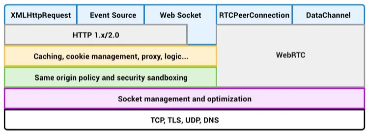
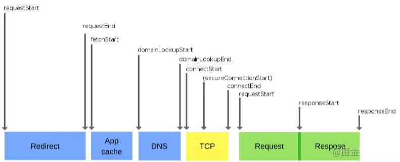

[Referer](https://juejin.cn/post/6844903608543084558)

- [WebSocket](./WebRTC/README.md)
- [WebRTC](./WebRTC/README.md)
- [Server-Side-Event](./SSE.md)
- [Fetch/XHR and Relatived Streams](./fetch&XHR.md)
- [Same-Orgin-policy](./Same-origin-policy.md)

- [导航时序规范](#导航时序规范)
- [源(Origin)](#源origin)
- [套接字池(Socket Pool)](#套接字池socket-pool)
- [Keep Alive](#keep-alive)
- [TLS 协商](#tls-协商)

- 用户在浏览器地址栏中输入 URL
- 给定一个 Web 资源的 URL，浏览器首先检查本地和应用程序缓存，并尝试使用本地副本完成请求。
- 如果缓存无法使用，浏览器将从 URL 中获取域名，并通过 DNS 请求 Server 的 IP 地址。如果该域被缓存，则不需要 DNS 查询。
- 浏览器创建一个 HTTP 数据包。
- 数据包发送到 TCP 层，在 HTTP 数据包的顶部添加它自己的信息。此信息将被用于维护已经开始的会话。
- 然后将数据包交给 IP 层，用于找出将数据包从用户发送到 Server 的途径。这些信息同样添加在数据包的顶部。
- 数据包发送到 Server。Server 一旦接收到数据包，就会以类似的方式发回响应。

#### [导航时序规范](https://link.juejin.cn/?target=http%3A%2F%2Fwww.w3.org%2FTR%2Fnavigation-timing%2F)

#### 源(Origin)

协议、域名、端口 三者构成(https, example.\com, 443)

#### 套接字池(Socket Pool)

一组属于同一源的套接字(通常浏览器限制为 6 个)

#### Keep Alive

允许浏览器重用套接字

#### TLS 协商

TLS(传输层安全协定)

- 完整的 TLS 步骤包含:
  1. Client 向 Server 发送『Client hello』消息，一同发送的还包括客户端产生的随机值和支持的密码套件。
  2. Server 向 Client 发送『Server hello』消息，及服务器产生的随机值进行响应。
  3. Server 将其认证证书发送给 Client，并可能向 Clinet 请求类似的证书。同时发送『Server hello done』消息。
  4. 如果 Server 向 Clinet 请求了证书，则 Client 发送它。
  5. Client 创建一个随机的预主密钥(Pre-Master Secret)，并使用 Server 证书中的公钥对其进行加密，再将加密的预主密钥发送。
  6. Server 接收到预主密钥。Server 和 Client 根据预主密钥生成主密钥和会话密钥。
  7. Clinet 向 Server 发送『Change cipher spec』消息，提示 Client 将开始使用会话密钥进行散列和加密消息。同时发送『Client finished』消息。
  8. Server 收到『Change cipher spec』的消息，并使用会话密钥将其记录层安全状态切换为对称加密。向 Clinet 发送『Server finished』消息。
  9. Clinet 和 Server 现在可以通过安全的通道交换应用数据。所有从当前 Clinet 发送并返回的消息均使用会话密钥加密。

任何一步校验失败，用户都将会收到警告。例如，服务器正在使用自签名证书。
