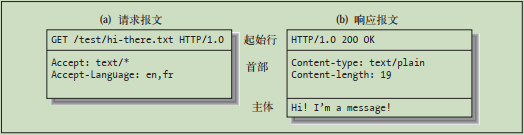

- [事物](#事物)
  - [报文](#报文)
- [结构组件](#结构组件)
  - [代理](#代理)
    - [代理配置](#代理配置)
    - [网关](#网关)
    - [隧道](#隧道)
    - [中继](#中继)
  - [缓存](#缓存)
- [URI](#uri)
  - [URL](#url)
  - [URN](#urn)
- [优化](#优化)
  - [时延](#时延)

## 事物

HTTP 事物以一个请求报文和一个响应报文组成

如果一个事务，不管是执行一次还是很多次，得到的结果都相同，这个事务就是*幂等的*

### 报文

HTTP 报文是由一行一行的简单字符串组成的。 HTTP 报文都是纯文本， 不是二进制

|                              起始行                              |                             首部字段                              |              主体              |
| :--------------------------------------------------------------: | :---------------------------------------------------------------: | :----------------------------: |
| 在请求报文中用来说明要做些什么，在响应报文中说明出现了什么情况。 | 每个首部字段都包含一个名字和一个值，用冒号:分隔。以一个 CRLF 结束 | 主体中可以包含二进制数据或文本 |

## 结构组件

### 代理

- 服务器代理: 位于客户端和服务器之间的 HTTP 中间实体
- 用户代理: 发起自动 HTTP 请求的半智能 Web 客户端(如浏览器、爬虫等)
- 反向代理: 假扮服务器接收和响应

#### 代理配置

- 客户端：
  1. 手工配置
  2. [PAC(Proxy Auto-Configuration)](https://www.cnblogs.com/milton/p/6263596.html): 提供一个 URI，指向一个用 Js 语言编写的代理自动配置文件；客户端下载这个 Js 文件，并运行来选择代理
  3. [WPAD 的代理发现(Web Proxy Auto-Discovery Protocol)](https://xz.aliyun.com/t/1739/): IE 特性，自动检测代理服务器

#### 网关

连接其他内容的特殊 Web 服务器，可用于将 HTTP 流量转换成其他的协议(如 FTP)

#### 隧道

允许在 HTTP 连接上嵌入非 HTTP 协议的流量，来通过某些只允许 HTTP 的防火墙

https://imququ.com/post/web-proxy.html

一种常见用途是通过 HTTP 连接承载加密的 SSL 流量(隧道在 C 和网关之间)：

1. C 发送一条 CONNECT 请求给隧道另一端的网关，C/网关/S 互相建立一条 TCP 连接
2. 网关发送一条 HTTP 200 Connection Established 给客户端
3. 之后，某一端发送 TCP 流量，网关都会盲转发 (转发所有流量被视作同一个没有中断/响应的 HTTP 请求)

#### 中继

中继就是没有完全遵循 HTTP 规范的简单代理

### 缓存

"新鲜度检测" 被称为 http 的再验证(revalidation)，缓存是否命中对 C 都是无感知的(304 是因为发送了 If-\* 头)

复杂的缓存组成了网状缓存(cache mesh)，其间的缓存代理称为内容路由器(content router)。之中常见的协议有因特网缓存协议(Internet Cache Protocol，ICP)、超文本缓存协议(HyperText Caching Protocol，HTCP)

http 主要通过 Age 和 Date 来计算缓存时间(其算法有对网络时延的补偿)。有两种简单机制进行再验证：

1. 文档过期(document expiration)
   - Cache-Control 及 Expires 首部进行协商过期时间
   - LM-factor 试探性过期算法估计过期时间
2. 服务器再验证(server revalidation)
   - If-Modified-Since、If-None-Match、If-Unmodified-Since、If-Range、If-Match 配合 Etag[1](#etag)、Last-Modified， 过期时才返回内容主体

- Etag:
  - `Etag: W/"v3.2"`弱实体: 只有发生重要变化才会变化
  - `Etag: "v3.2"`强实体: 内容发生任何变化，其都会变化

## URI

URI(Uniform Resource Identifier)分为：

### URL

遵循标准格式(`<scheme>://<user>:<password>@<host>:<port>/<path>;<params>?<query>#<frag>`)的 URI

说明如何从一个精确、 固定的位置获取资源

ftp 若没指定 user:password，ftp 客户端会使用 anonymous:自定义密码的组合

每个 path 都可以有自己的 params。[params 和 query 的不同](https://stackoverflow.com/a/39294675)

frag 并不会在请求中被发送，通常用于浏览器定位

- 源(Origin): 协议、域名、端口 三者构成(https, example.\com, 443)

### URN

处于实验阶段。作为特定内容的唯一名称使用的， 与目前的资源所在地无关

## 优化

https://www.w3.org/Protocols/HTTP/Performance/

### 时延

|      |                                      并行连接                                      |                                                持久连接                                                 |                管道化连接                 |       复用的连接       |
| :--: | :--------------------------------------------------------------------------------: | :-----------------------------------------------------------------------------------------------------: | :---------------------------------------: | :--------------------: |
| 说明 |                      通过多条并发的 TCP 连接发起 HTTP 请求。                       |                                              重用 TCP 连接                                              |  通过持久的 TCP 连接发起并发的 HTTP 请求  | 交替传送请求和响应报文 |
| 应用 | - 套接字池(Socket Pool): 一组属于同一源的套接字(即同一网页，通常浏览器限制为 6 个) | - Keep-Alive(Http/1.0+)[1](#sup1) - persistent connection(Http/1.1)[2](#sup2) | - 请求管道 Http(1.1)[3](#sup3) |           /            |
| 缺点 |            低带宽时，一条连接就可能消耗所有带宽，多条则产生竞争增加时延            |                                                    /                                                    |                     /                     |           /            |

1. Keep-Alive 的问题

   - 发出 keep-alive 请求之后，C/S 并不一定会同意进行 keep-alive 会话。它们可以在任意时刻关闭空闲的 keep-alive 连接，并可随意限制 keep-alive 连接所处理事务的数量
   - Connection: Keep-Alive 首部必须随**所有希望保持持久连接的报文**一起发送
   - 只有当连接上所有的报文都有正确的报文长度时，连接才能保持
   - 在有盲中继(blind relay，只将字节从一个连接转发到另一个连接中去，不对 Keep-Alive 进行特殊处理)的情况下，会产生哑代理问题(C/S 保持连接，但代理中断响应)。因此现代代理将删除相关的 Connection/Keep-Alive 首部，且浏览器会忽略

2. persistent connection

   - 除非特别指明，否则 HTTP/1.1 假定所有连接都是持久的。要在事务处理结束之后将连接关闭，C/S 必须向报文中显式地添加一个 Connection: close 首部
   - C/S 仍然可以随时关闭空闲的连接
   - 只有当连接上所有的报文都有正确的报文长度时，连接才能保持
   - 持久连接只适用于一跳传输。代理需要分别管理对 C/S 的持久连接
   - C 最多只能维护 2 条持久连接，以防止服务器过载

3. 请求管道
   - 必须按照与请求相同的顺序回送 HTTP 响应
   - C 必须做好连接会在任意时刻关闭的准备，还要准备好重发所有未完成的管道化请求
   - 不应该用管道化的方式发送会产生副作用的请求(如 POST)。出错时，管道化方式会阻碍 C 了解 S 执行的是一系列管道化请求中的哪一些。而非幂等请求(如 POST)无法安全地重试，因此就存在某些方法永远不会被执行的风险
